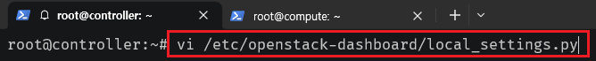
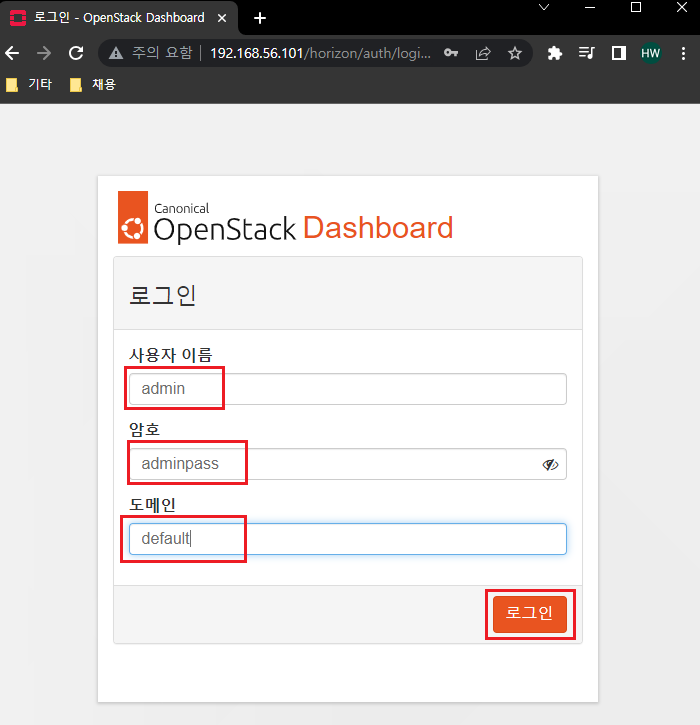

[뒤로가기](../../README.md)<br>

# 대시보드 Horizon

Openstack 서비스를 웹 기반 사용자 인터페이스로 제공하는 플러그인이다.

## 환경

- Openstack : yoga
- Controller Node

  - VirtualBox
  - CPU : 2
  - Memory : 4096MB
  - Network Device : Host(enp0s3), Bridge(enp0s8), NAT(enp0s9)
  - Storage : SATA 20GB(운영체제)
  - Ubuntu : ubuntu-20.04.6-live-server-amd64

- Compute Node
  - VirtualBox
  - CPU : 2
  - Memory : 5012MB
  - Network Device : Host(enp0s3), Bridge(enp0s8), NAT(enp0s9)
  - Storage : SATA 20GB(운영체제), 8GB(블록 Storage), 8GB \* 3 (오브젝트 Storage)
  - Ubuntu : ubuntu-20.04.6-live-server-amd64

## 시작

### (1) 대시보드 설치 및 설정 [Controller]


> apt-get install openstack-dashboard

Openstack dashboard를 설치한다.<br>



> vi /etc/openstack-dashboard/local_settings.py

로컬 환경 설정에 들어간다.<br>


> ALLOWED_HOSTS = ['*']

Openstack 호스트를 지정한뒤 대시보드에 접속가능한
호스트를 설정한다.<br>
여기서는 일단 모든 호스트가 접속이 가능하도록 설정한다.<br>


```
SESSION_ENGINE='django.contrib.sessions.backends.cache'
CACHES = {
    'default': {
        'BACKEND': 'django.core.cache.backends.memcached.MemcachedCache',
        'LOCATION': '192.168.56.101:11211',
    },
}
```

memcached의 스토리지 서비스를 구성한다.<br>


```
OPENSTACK_HOST = "192.168.56.101"
OPENSTACK_KEYSTONE_URL = "http://%s:5000/v3"%OPENSTACK_HOST

TIME_ZONE = "Asia/Seoul"

OPENSTACK_KEYSTONE_MULTIDOMAIN_SUPPORT = True
OPENSTACK_API_VERSIONS = {
    "identity": 3,
    "image": 2,
    "volume": 3,
}

OPENSTACK_KEYSTONE_DEFAULT_DOMAIN = "Default"
OPENSTACK_KEYSTONE_DEFAULT_ROLE = "user"

```

Keystone 인증 URL을 변경하고 시간을 한국으로 변경한다.<br>

그리고 도메인 지원을 활성화한뒤 OPENSTACK API 버전을 설정한다.<br>

기본 도메인을 Default를 설정하고 기본 규칙또한 user로 설정한다.<br>
<br>

### (2) 실행 테스트 [Controller]


> systemctl reload apache2.service

아파치 서버의 설정을 재구성한다.



http://192.168.56.101/horizon/ 에 접속한다.<br>
그리고 다음과 같이 입력하고 로그인한다.<br>


## [참고]

### 각 서비스를 설치한뒤 반드시 VM의 스냅샷을 찍어 기록해두자.

Openstack 설치 과정에서 에러가 날 경우 다시 복원할 수 있어야한다.<br>
