[뒤로가기](../../README.md)

# OpenStack 인스턴스 생성

최종적으로 구성한 Openstack 환경에서 인스턴스를 생성한다.<br>
생성하는 인스턴스는 glance에서 설치한 cirros 이미지로 한다.<br>
계정은 구성중에 생성한 demo 계정으로 한다.<br>

## 환경

- Openstack : yoga
- Controller Node

  - VirtualBox
  - CPU : 2
  - Memory : 4096MB
  - Network Device : Host(enp0s3), Bridge(enp0s8), NAT(enp0s9)
  - Storage : SATA 20GB(운영체제)
  - Ubuntu : ubuntu-20.04.6-live-server-amd64

- Compute Node

  - VirtualBox
  - CPU : 2
  - Memory : 5012MB
  - Network Device : Host(enp0s3), Bridge(enp0s8), NAT(enp0s9)
  - Storage : SATA 20GB(운영체제), 8GB(블록 Storage), 8GB \* 3 (오브젝트 Storage)
  - Ubuntu : ubuntu-20.04.6-live-server-amd64

## 시작

### (1) Provider Network 생성 [controller]

인스턴스의 IP를 할당할 가상 네트워크를 생성한다.<br>
첫번째로 Provider Network를 구축한다.<br>
Provider Network는 오픈스택을 서비스하는 운영자가 구축하는 <br>네트워크로 실제 인터넷과 연결되는 네트워크이다.<br>

인스턴스에 할당되는 가상 네트워크인 Self-Service Network는<br> 해당 Provider Network에 라우터를 연결하여 인터넷과 연결하게 된다.<br>

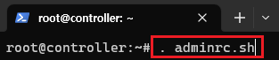<br>

> . adminrc.sh

관리자 계정으로 전환한다.<br>

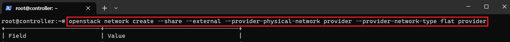<br>

> openstack network create --share --external --provider-physical-network provider --provider-network-type flat provider

--share : 다른 프로젝트와 공유가 가능하도록 설정한다.<br>
--external : 외부 네트워크를 생성한다.<br>
--provider-physical-network provider : prvider은 물리적 네트워크이다.<br>
--provider-network-type flat : flat은 물리적 네트워크가<br>
VXLAN, VLAN과 같은 네트워크 가상화 기술을 사용하지 않고<br>
단순히 물리적 네트워크를 사용하는 경우에 사용된다.<br>
VXLAN, VLAN은 Self-Service Network에 생성된다.<br>

즉, 호스트에 실제 네트워크를 구성한다.

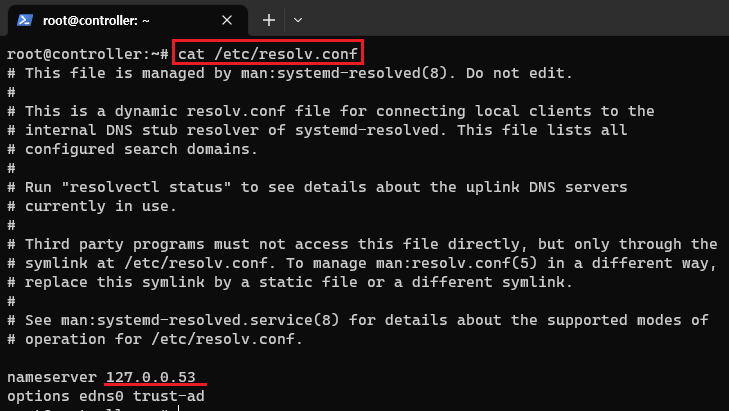<br>

> cat /etc/resolv.conf

Provider의 서브넷을 구성하기전에 호스트의 DNS 네임 서버를 확인한다.

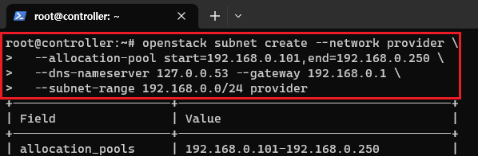<br>

```
openstack subnet create --network provider \
  --allocation-pool start=192.168.0.101,end=192.168.0.250 \
  --dns-nameserver 127.0.0.53 --gateway 192.168.0.1 \
  --subnet-range 192.168.0.0/24 provider
```

--allocation-pool : 서브넷의 IP 주소를 동적으로 할당한다.<br>
여기서 start와 end 범위내에서 지정하게된다.<br>
--gateway : 가상 네트워크와 라우팅하기 위해 생성한다.<br>
--subnet-range : 서브넷의 IP 주소 범위를 지정한다. CIDR형식으로 설정했다.<br>

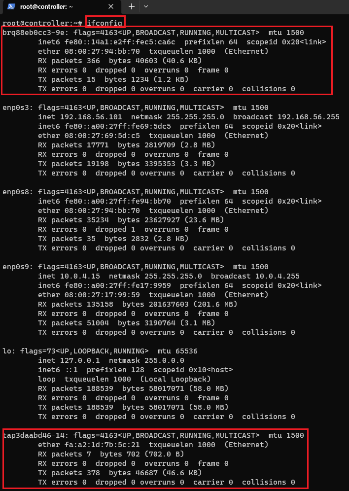<br>

> ifconfig

실제 네트워크가 구성된것을 확인한다.<br>

### (2) Self-Service Network 생성 [controller]

이제 demo 계정의 가상 네트워크를 구성한다.

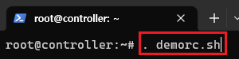<br>

> . demorc.sh

demo계정으로 전환한다.

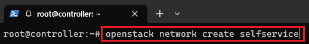<br>

> openstack network create selfservice

가상 네트워크를 생성한다.

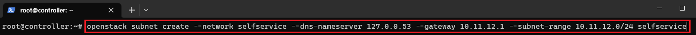<br>

> openstack subnet create --network selfservice --dns-nameserver 127.0.0.53 --gateway 10.11.12.1 --subnet-range 10.11.12.0/24 selfservice

가상 네트워크의 서브넷을 생성한다.<br>
여기서 dns 서버의 IP주소를 확인한다.<br>
남은 IP 지정은 임의로 설정한다.<br>

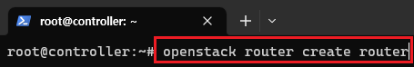<br>

> openstack router create router

provider와 연결하기 위해 가상 라우터를 생성한다.

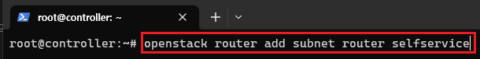<br>

> openstack router add subnet router selfservice

방금 생성한 가상 네트워크를 라우터의 인터페이스로 추가한다.

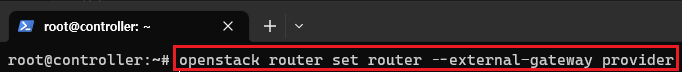<br>

> openstack router set router --external-gateway provider

실제 네트워크인 provider를 라우터의 게이트웨이로 설정한다.<br>
이제 외부와 통신이 가능하다.<br>

### (3) 테스트 [controller]

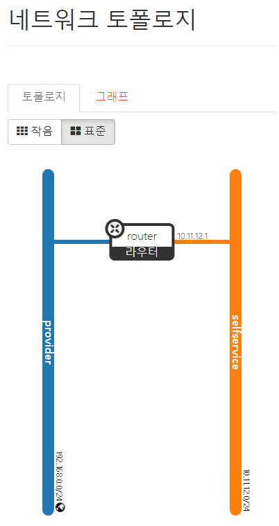<br>
대시보드의 네트워크 토폴로지를 확인하면 연결이 된것을 확인할 수 있다.
<br>

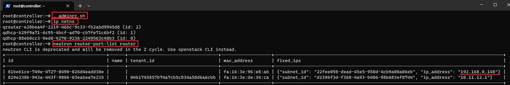<br>

> . adminrc.sh

> ip netns

가상 네트워크가 생성되었는지 확인한다.

> neutron router-port-list router

생성한 라우터의 포트 정보를 확인하면 생성한 두개의 네트워크가 연결이 된것을 확인할 수 있다.<br>

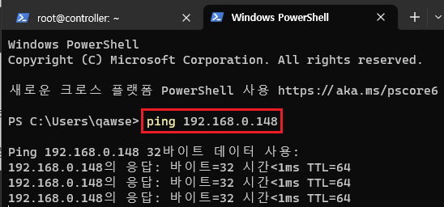<br>

> ping 192.168.0.148

해당 ip로 ping을 보내면 응답받는 것을 확인한다.<br>

### (4) Flavor 생성 [controller]

Flavor는 인스터스의 사양을 결정한다.<br>
CPU 갯수, 메모리 크기, 저장소의 용량등의 정보를 저장해
인스턴스에 할당한다.<br>

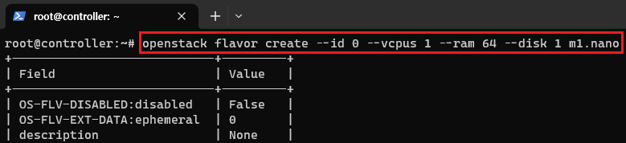<br>

> openstack flavor create --id 0 --vcpus 1 --ram 64 --disk 1 m1.nano

cpu 1개, 메모리 64MB, 저장소 1GB인 작은 사양의 Flavor를 생성한다.<br>

### (5) keypair 생성 [controller]

대부분 클라우드 이미지는 패스워드 대신 공용 키 인증 방식을 지원한다.<br>
해당 인스턴스에 접속할때도 필요하기에 생성한다.<br>

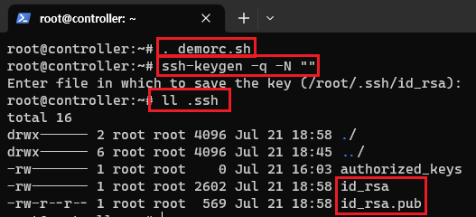<br>

> . demorc.sh<br>
> ssh-keygen -q -N ""<br>

-q : 출력이 최소화되어 사용자 입력을 최소화한다.<br>
-N "" : 생성될 키의 암호화 패드워드를 지정한다.<br>
여기서는 설정하지 않고 넘어간다.<br>

> ll .ssh<br>

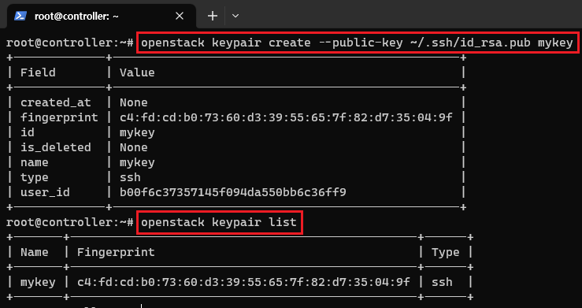<br>

> openstack keypair create --public-key ~/.ssh/id_rsa.pub mykey

> openstack keypair list

openstack에 public 키를 등록한다.<br>
실제로 등록이 되었는지도 확인한다.<br>

### (6) 보안 그룹 생성 [controller]

인스턴스의 방화벽이라 생각하면 된다.<br>
아무나 생성한 인스턴스에 접근하면 안되기에 보안 그룹을 통해<br>
해당 인스턴스에 접근할 수 있는 룰을 설정한다.<br>

여기서는 테스트 용도이기에 누구나 접속이 가능하게 설정하며 SSH 접속도 가능하게 설정한다.<br>

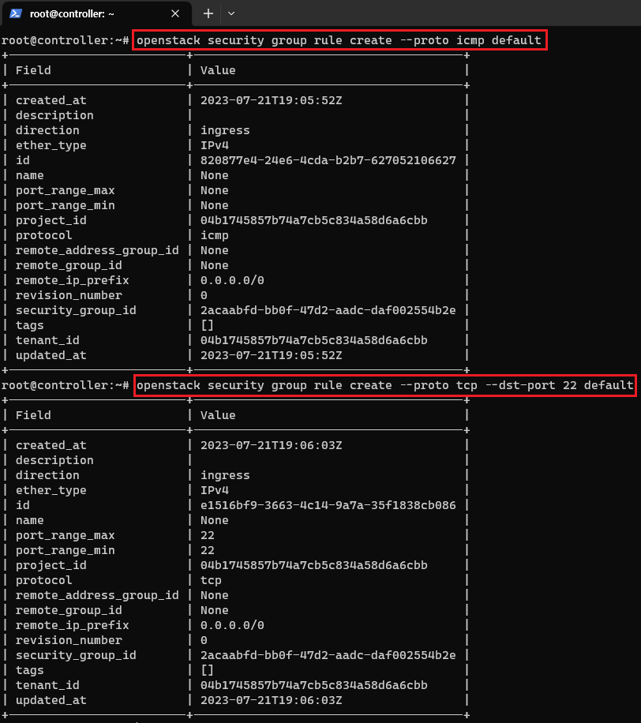<br>

> openstack security group rule create --proto icmp default

default 그룹에 ICMP 프로토콜을 등록한다.<br>
ICMP는 주로 ping 테스트등 오류 메세지 전달하는데 사용되는 프로토콜이다.<br>

> openstack security group rule create --proto tcp --dst-port 22 default

default 그룹에 외부에서 SSH 접속이 가능하게 설정한다.<br>

### (7) 인스턴스 생성 [controller]

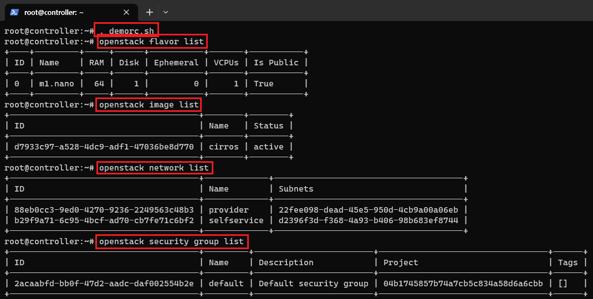<br>

> . demorc.sh<br>
> openstack flavor list<br>
> openstack image list<br>
> openstack network list<br>
> openstack security group list<br>

최종적으로 설정한 flavor, 이미지, 네트워크 보안 그룹을 확인한다.

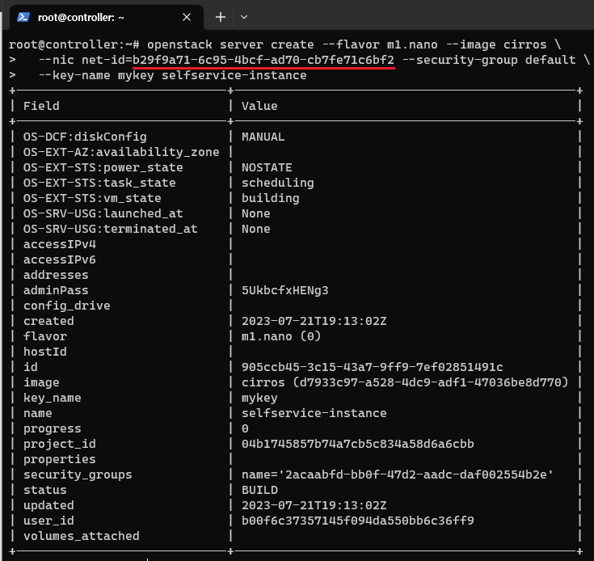<br>

```
openstack server create --flavor m1.nano --image cirros \
  --nic net-id=자신의 selfservice 네트워크 ID --security-group default \
  --key-name mykey selfservice-instance
```

인스턴스를 생성한다.

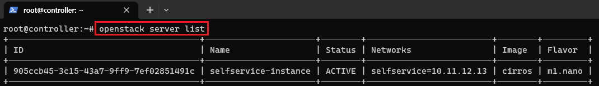<br>

> openstack server list

생성된 인스턴스를 확인한다.<br>
상태가 ACTIVE이면 정상적으로 작동 중이다.<br>
축하한다.<br>

### (8) 인스턴스 접속 [controller]

[웹 접속]

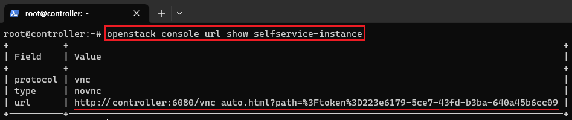<br>

> openstack console url show selfservice-instance

오픈스택에서는 웹을 통해 인스턴스에 접속할 수 있게 제공한다.<br>
url를 클릭해 접속해보자.<br>

여기서 url앞의 controller는 본인 IP로 변경해야한다.<br>
여기서는 192.168.56.101 이다.<br>

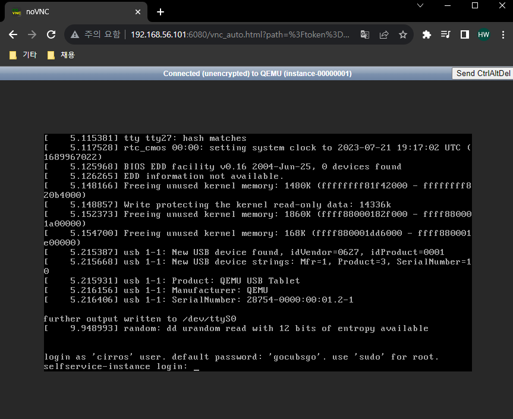<br>

접속 화면이다.<br>

[SSH 접속]
인스턴스에 원격으로 접속하기 위해서는 Floating IP를 생성해야된다.

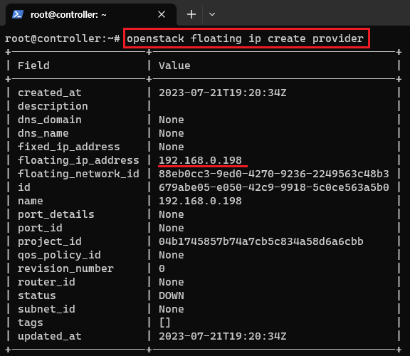<br>

> openstack floating ip create provider

floating ip를 생성한다.<br>
생성된 ip를 복사해둔다.<br>

<br>

> openstack server add floating ip selfservice-instance 192.168.0.198

> openstack server list

생성한 floating ip를 인스턴스와 연결한다.<br>
그리고 인스턴스를 확인하면 floating ip가 등록이 된것을 확인할 수 있다.<br>

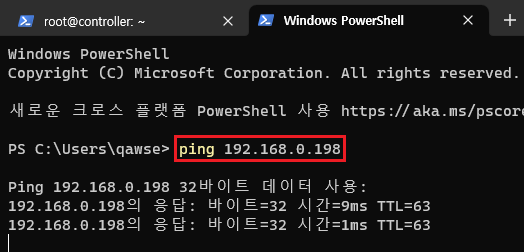<br>

> ping 192.168.0.198

해당 인스턴스에 ping을 보내면 잘 보내진다.<br>

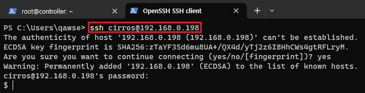<br>

> ssh cirros@192.168.0.198

원격 접속도 시도한다.<br>
초기 비밀번호는 gocubsgo 이다.<br>
