[뒤로가기](../../README.md) 

# Openstack 이미지 등록

 

Glance 서비스를 구성할때 cirrOS 이미지를 등록한적이 있다. 
여기서는 CLI, 대시보드 방식으로 우분투 이미지를 등록한다. 

## 우분투 이미지 검색

OS를 제공하는 사이트에서는 대체적으로 클라우드 컴퓨팅 환경에서 바로 사용할 수 있는 이미지를 제공한다.

[우분투 클라우드 이미지](https://cloud-images.ubuntu.com/)

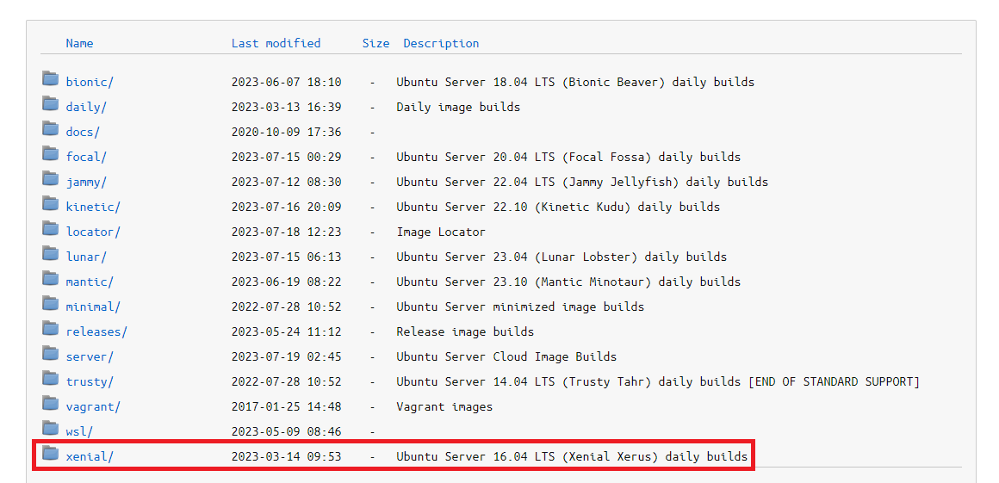 

16.04 LTS 버전을 등록하기위해 xenial 폴더로 들어간다. 

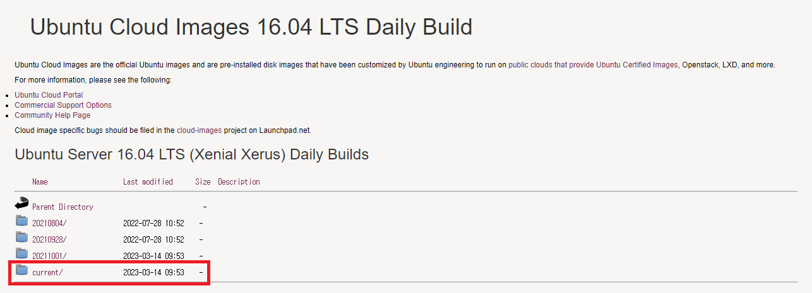 

current를 선택한다. 

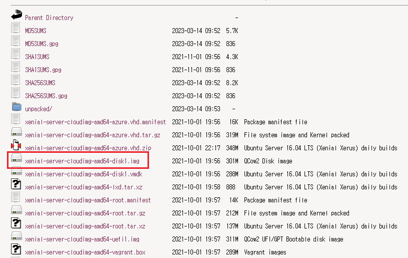 
xenial-server-cloudimg-amd64-disk1.img 
이미지를 클릭해 다운받는다.

## 대시보드 방식

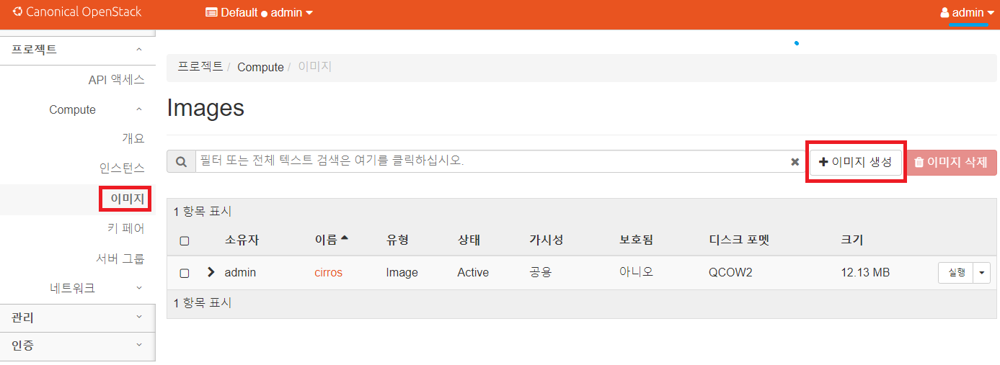 

admin으로 접속한뒤 이미지 -> 이미지 생성을 클릭한다. 

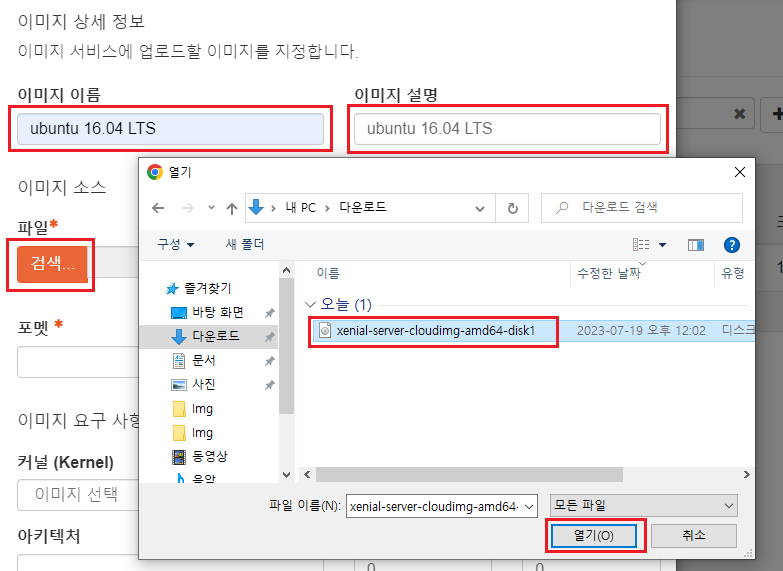 

이미지 이름과 설명을 입력하고 
파일 검색으로 다운받은 이미지를 선택한다. 

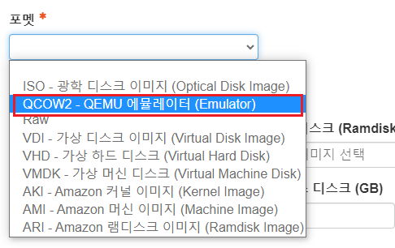 

그리고 포맷 방식을 QCOW2를 선택한다. 
오픈스택에서는 우분투 이미지 포맷 방식을 QCOW2로 권장한다. 

이렇게 선택한뒤 이미지 생성을 클릭한다. 

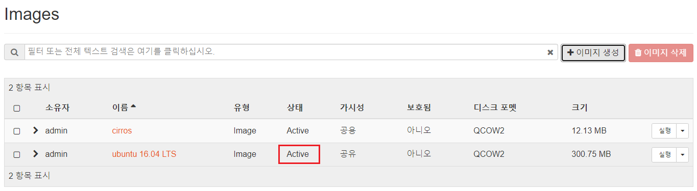 

등록이 된것을 확인할 수 있다. 

## CLI 방식 [Controller]

CLI 방식으로는 우분투 14.04 버전을 등록한다.

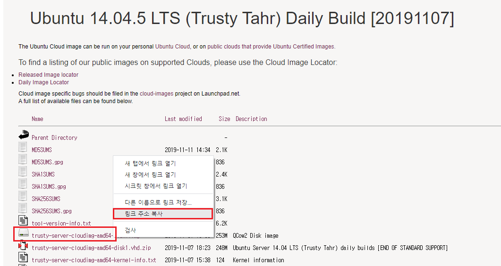 

trusty-server-cloudimg-amd64-disk1.img  해당 이미지를 찾은뒤 오른쪽 클릭해 링크를 복사한다. 

> https://cloud-images.ubuntu.com/trusty/current/trusty-server-cloudimg-amd64-disk1.img

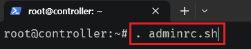 

admin 계정으로 전환한다.

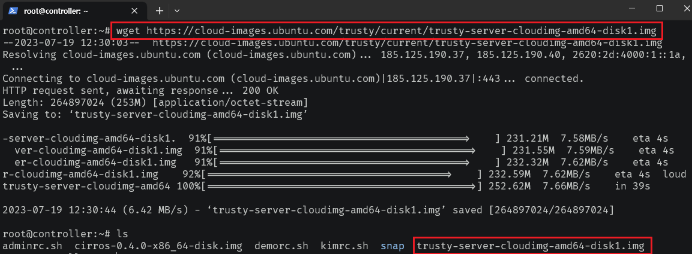 

> wget https://cloud-images.ubuntu.com/trusty/current/trusty-server-cloudimg-amd64-disk1.img

wget으로 OS를 설치한다.

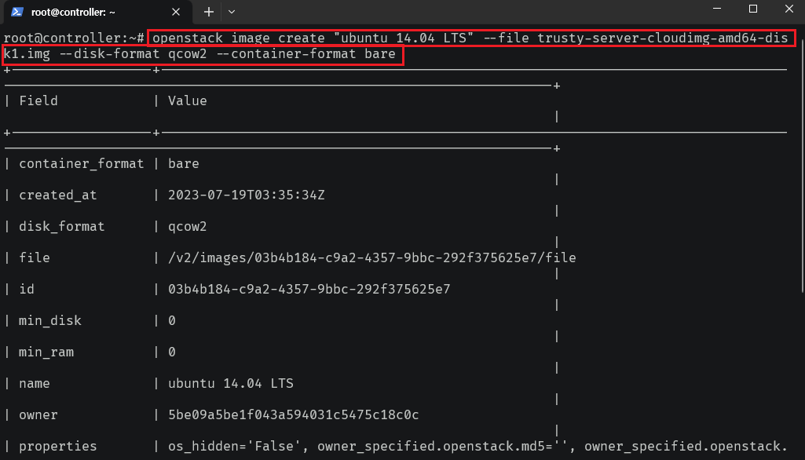 

> openstack image create "ubuntu 14.04 LTS" --file trusty-server-cloudimg-amd64-disk1.img --disk-format qcow2 --container-format bare

이미지를 등록한다.

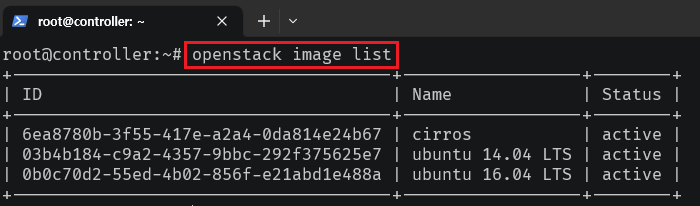 

> openstack image list

등록이 되었는지 확인한다.

bare은 컨테이너 형식을 지정하는 값으로, 이미지 파일이 가공되지 않고 그대로 사용된다. 
qcow2는 디스크 포맷 방식으로 압축된 방식으로 이미지 파일을 저장한다. 
