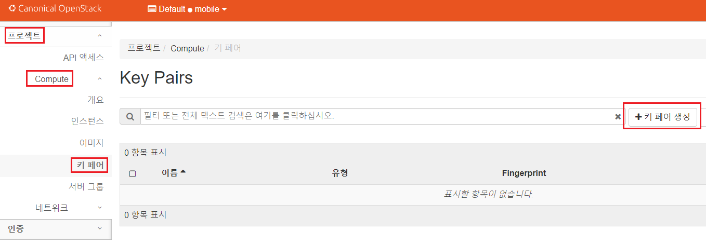

[뒤로가기](../../README.md) 

# Openstack 인스턴스 생성

### (1) 방화벽 정책 설정

사용자가 사용하는 인스턴스에 아무나 접근해서는 안된다. 
그래서 시큐리티 그룹에서 보안 그룹을 설정한다. 

모바일 사용자 계정으로 로그인한뒤 네트워크 -> 보안 그룹으로 들어간뒤 
보안 그룹 생성을 클릭한다. 

 

보안 그룹 이름과 설명을 입력한뒤 보안 그룹을 생성한다. 

 
보안 그룹이 생성되면 외부 접근이 가능할 수 있도록 규칙 추가를 클릭한다. 

테스트용이기에 모든 IP가 접근 가능하도록 모든 ICMP를 선택한뒤 추가를 한다. 

그리고 SSH 연결도 가능하게 SSH 규칙도 추가한다. 

### (2) 키페어 생성

인스턴스에 접근할 수 있는 SSH 키를 생성한다. 
 
프로젝트 -> Compute -> 키페어로 이동한뒤 키페어 생성을 클릭한다. 

 
키페어 이름을 입력하고 SSH 키를 선택한뒤 키페어를 생성한다. 

 
키페어가 생성되고 자동으로 키페어 파일을 제공한다. 

### (3) flavor 생성 [controller]

flavor는 인스턴스의 메모리 크기와 하드 디스크 용량을 어떻게 사용할지의 정보를 나타낸다. 
하지만, 현재 flavor가 생성되지 않았기에 flavor를 생성한다. 

 
컨트롤러 노드에 접속해 관리자 계정으로 전환한다. 
확인해보니 flavor가 없다고 나온다. 

 

> openstack flavor create --id 0 --ram 64 --disk 1 --vcpus 1 --public m1.nano

메모리는 64MB, 저장소는 1GB, cpu는 1개인 m1.nano flavor를 생성한다. 
여기서 --public 설정으로 누구나 쓸 수 있게 한다. 

### (3) 인스턴스 생성

 
프로젝트 -> Compute -> 인스턴스로 들어간뒤 인스턴스 시작을 클릭한다. 

 
세부 정보를 클릭한뒤 인스턴스 이름과 설명을 입력하고 Next를 클릭한다. 

 
우분투 16.04를 선택하고 Next를 클릭한다. 

 
방금 생성한 flavor를 등록하고 Next를 클릭한다. 

 
생성했던 네트워크를 등록하고 Next를 클릭한다. 
보안 그룹으로 넘어간다. 

 
default를 내리고 방금 생성한 보안 그룹을 등록한뒤 키페어로 넘어간다. 

 
키페어는 자동으로 등록이 되어 있다. 
이제 인스턴스 시작을 누른다. 
