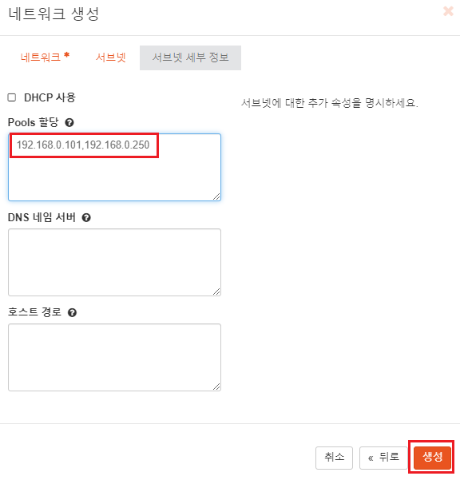

[뒤로가기](../../README.md) 

# Openstack 네트워크 생성

생성한 프로젝트의 네트워크를 생성한다. 
적용될 프로젝트는 [프로젝트 생성](./openstack_oper_project.md)에서 생성한 mobile 프로젝트이다.

## [대시보드]

### (1) 서브넷 생성

프로젝트의 네트워크를 생성하려면 어떤 IP 범위로 할당할지 설정해야한다. 
이때 설정한 IP 범위가 서브넷이다. 

 

moblie 프로젝트에 속한 사용자로 로그인한뒤, 
프로젝트-> 네트워크 -> 네트워크 -> 네트워크 생성을 클릭한다. 

 
네트워크 이름을 설정하고 다음을 클릭한다. 

 

서브넷 이름을 입력하고 
네트워크 주소는 10.10.10.0/24 
게이트웨이는 10.10.10.1로 설정하고 다음을 클릭한다. 

[네트워크 주소 : 10.10.10.0/24] 
24비트 서브넷 마스크를 사용하는 IPv4주소이며, 
IP주소의 첫 24비트가 네트워크 주소이고 마지막 8비트가 호스트 주소이다. 
즉, 10.10.10.0 ~ 10.10.10.255까지 총 256개의 주소의 범위를 가지게된다. 
단, 10.10.10.0은 네트워크 주소 10.10.10.255은 브로드캐스트 주소이다. 
그래서 둘의 주소를 제외한 10.10.10.1 ~ 10.10.10.254가 호스트 주소로 사용된다. 

[게이트웨이 주소 : 10.10.10.1] 
다른 네트워크나 인터넷과 통신하기 위해 사용되는 주소이다. 
프로젝트가 외부와 통신하기 위해서는 퍼블릭 네트워크와  연결할 수 있는 라우터가 필요하다. 
게이트웨이는 일반적으로 네트워크 내의 라우터를 가리키는 주소가 된다. 

 
하지만, 해당 서브넷은 퍼블릭 네트워크를 생성하지 않으므로 해당 내용은 생략하고 생성한다.

 
생성한 mobile-net의 정보를 확인하면 포트에서
DHCP용 IP가 자동으로 할당되었다. 

### (2) provider 네트워크 생성

네트워크 IP는 인스턴스를 생성할때 인스턴스에 할당된다. 
그러나 프로젝트 네트워크는 사설(가상) IP범위여서 외부와 통신할 수 없다. 
외부와 통신하려면 외부 네트워크인 provider 네트워크와  연결해야되는데 이때 필요한게 라우터이다. 

하지만 아직 우리는 외부 네트워크인 provider가 없다. 
그래서 provider 네트워크부터 생성한다. 

생성하기전 Controller 노드의 네트워크 설정을 체크한다. 
 

> vi /etc/neutron/plugins/ml2/ml2_conf.ini 

[ml2_type_flat]의 flat 타입이 provider인지 확인하다. 

> vi /etc/neutron/plugins/ml2/linuxbridge_agent.ini

provider가 실제 외부랑 통신할때 네트워크 디바이스인 enp0s8로 매핑되었는지 확인한다. 

 

> vi /etc/network/interfaces

마지막으로 enp0s8이 메뉴얼로 설정되었는지 확인한다. 

 

admin으로 로그인한뒤, 
관리 -> 네트워크 -> 네트워크 -> 네트워크 생성을 클릭한다. 

 

이름은 provider 
프로젝트는 관리자 프로젝트인 admin으로 선택한다. 
공급자 네트워크 유형은 Flat를 선택한다. 
물리적인 네트워크는 우리가 설정한 provider로 입력한다. 

 
서브넷 이름을 입력하고 네트워크주소와 게이트웨이 IP를 입력한다. 

 
마지막으로 IP범위를 설정하고 생성한다.

### (3) 라우터 생성

 
다시 mobile 프로젝트의 계정으로 로그인한뒤 
네트워크 -> 네트워크 토폴리지로 들어간다. 

다음과 같이 두개의 네트워크가 생성되었고 provider는 
외부 네트워크라는 표시로 지구본 아이콘이 표시된다. 
이제 라우터를 생성해 두개를 연결한다. 

 
네트워크 -> 라우터로 들어가 라우터 생성을 클릭한다. 

 
라우터 이름을 입력하고 외부 네트워크에서 방금 생성한  provider를 선택하고 라우터를 생성한다.

### (4) 인터페이스 추가

외부 게이트웨이와 연결하려면 프로젝트 내부의 네트워크를 설정해야한다.
인스턴스가 프로젝트 네트워크의 게이트웨이를 거쳐 provider 게이트웨이를 타고 외부와 통신할 수 있다.

 
생성한 라우터를 클릭한다.

 
인터페이스 항목에서 인터페이스 추가를 클릭한다.

 

moblie 네트워크의 서브넷을 선택하고 
moblie 네트워크의 게이트웨이 IP를 입력한뒤 제출한다. 

 
현재 상태가 Down일것이다. 
조금 기다린뒤에 새로고침하면 Active가 될것이다. 

### (5) 확인

아직 인스턴스를 생성하지않아서 외부와 연결이 되는지 확인 불가능하다. 
대신, 네트워크가 설정이 되었는지 확인한다. 

 
네트워크 폴리지에서 라우터로 연결이 되었는지 확인한다.

 

> . adminrc.sh

controller 노드에서도 확인해보기위해 관리자로 접속한다.

 

> openstack network list

현재 생성한 네트워크를 확인한다.

> openstack network show provider

provider의 세부 정보에서 라우터가 외부용으로 설정된것을 확인할 수 있다.

 

> ip netns show

가상 네트워크 정보를 확인한다.
가상 라우터와 DHCP 네트워크를 확인할 수 있다.

 

> ip netns exec qrouter-e827388a-d42d-4651-b810-bc7a0420f92f ifconfig

생성한 가상 라우터의 정보를 확인해
ip 주소가 정상적으로 잡혔는지 확인한다. 

여기까지 설정하면 인스턴스 내부에서 외부로 통신이 가능하다. 
외부에서 인스턴스 내부로 접근하려면 Floating IP할당과
보안 그룹 설정등을 해야한다. 
해당 사항은 인스턴스 생성과정에서
네트워크 테스트과 같이 진행한다. 
