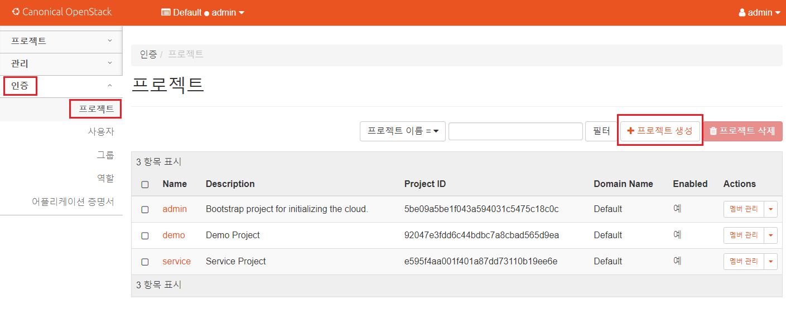
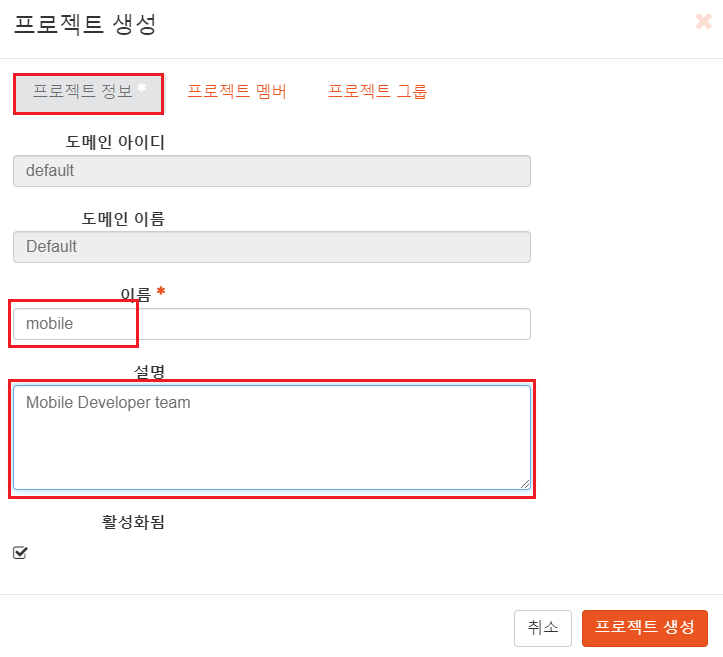

[뒤로가기](../../README.md)<br>

# Openstack 프로젝트 생성

실제 개발 부서에서 신규 프로젝트를 시작할때 운영 부서에게<br>
Openstack 인스턴스를 요청하게 된다.

하지만, 운영 부서에서 매번 인스턴스를 일일이 생성해<br> 보내주는것도 번거로우면 관리면에서도 힘들다.<br>

그래서 운영 부서에서 Openstack의 프로젝트를 생성하고 <br>사용자를 추가한 뒤 개발 부서에게 해당 계정 정보를 넘겨주고<br>
개발 부서가 직접 인스턴스를 생성해 사용한다.

## [대시보드 방식]

### 프로젝트 생성

모바일개발팀에서 요청이 들어왔다고 가정하며 프로젝트를 생성해본다.

[프로젝트]<br>
부서 이름이나 그룹 이름이라 생각하면 된다.<br>
<br>

http://192.168.56.101/horizon/ <br>
Openstack 대시보드에서 admin으로 로그인한다.<br>

<br>

인증 -> 프로젝트 -> 프로젝트 생성을 누른다.

<br>
프로젝트 정보에서 이름과 팀 설명을 작성한다.<br>

<br>
프로젝트 멤버를 구성할 수 있다.<br>
하지만 아직 사용자를 생성안했으니 생략한다.<br>

<br>

[프로젝트 그룹]<br>
규모가 큰 프로젝트면 작은 단위로 프로젝트를 나눠 개발을 진행한다.<br>
이때 큰 프로젝트와 관련된 프로젝트들을 모아서 관리하는게 프로젝트 그룹이다.<br>

지금은 그룹이 없으니 생략하고 프로젝트 생성을 클릭한다.<br>

<br>

다음과 같이 프로젝트가 생성된것을 볼 수 있다.<br>

### 사용자 생성

<br>
인증 -> 사용자 -> 사용자 생성을 클릭한다.<br>

<br>
사용자 정보를 작성한다.<br>
여기서 최초 프로젝트는 방금 생성한 프로젝트를 선택<br>
역할은 일반 사용자인 member로 설정한다.<br>
그리고 생성한다.<br>

<br>
사용자 리스트에 등록된걸 확인한다.

### 로그인

<br>
상단을 눌러 로그아웃을 한다.<br>

<br>
방금 생성한 사용자 이름과 비밀번호를 입력해 로그인한다.<br>

## [CLI 방식] [Controller]

CLI 방식으로 사용자를 관리하는 법을 정리한다.

[프로젝트 생성]

> openstack project create –domain [DOMAIN_NAME] –description [DESCRIPTION] [PROJECT_NAME]

[사용자 생성]

> openstack user create –domain [DOMAIN_NAME] –password-prompt [USER_NAME]

[사용자 역할 및 프로젝트 설정]

> openstack role add –project [PROJECT_NAME] –user [USER_NAME] [ROLE_NAME]

이번에는 WEB 개발팀에서 요청이 왔다 가정하며 생성한다.

<br>

> . adminrc.sh

관리자로 로그인한다. (인증)<br>

<br>

> openstack project create --domain default --description "Web Developer Team" web

web 프로젝트를 생성한다.<br>

<br>

> openstack user create --domain default --password-prompt kim

사용자를 생성한다.<br>
비밀번호는 1q2w3e4r로 설정한다.<br>

<br>

> openstack role list

역할 설정전에 어떤 역할이 있는지 확인한다.<br>

> openstack role add --project web --user kim member

다음과 같이 프로젝트와 사용자 그리고 부여할 역할을 지정하면<br>
해당 프로젝트에 자동으로 사용자가 등록되고 역할도 부여된다.<br>

<br>

> cp adminrc.sh kimrc.sh

생성한 사용자로 인증하기 위해 adminrc.sh을 복사해 새로운 파일을 생성한다.<br>

<br>

생성한 파일을 수정한다.<br>

```
export OS_PROJECT_DOMAIN_NAME=Default
export OS_USER_DOMAIN_NAME=Default
export OS_PROJECT_NAME=web
export OS_USERNAME=kim
export OS_PASSWORD=1q2w3e4r
export OS_AUTH_URL=http://controller:5000/v3
export OS_IDENTITY_API_VERSION=3
```

<br>

> . kimrc.sh

kim으로 로그인한다.<br>

<br>

> openstack project list

자신이 속한 프로젝트 리스트를 확인할 수 있다.<br>
web만 있는거 보면 잘 등록되었다.<br>
