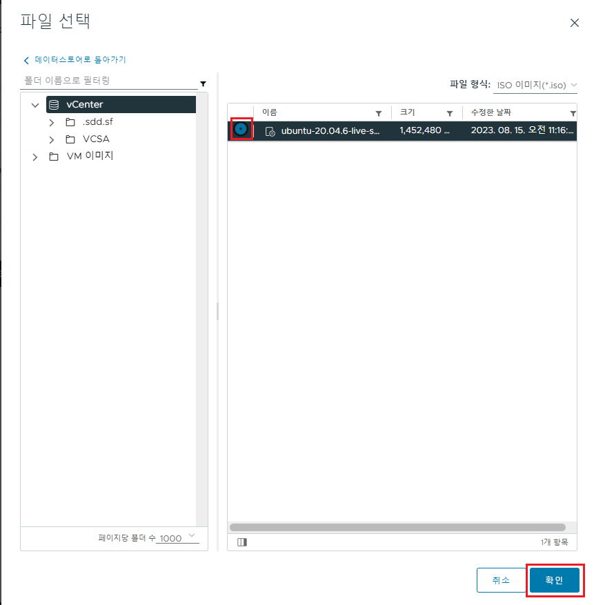

[뒤로가기](../../README.md) 

# vCenter VM 생성

vCenter를 활용하여 연결된 EXSi에 VM을 생성해본다. 

문제는.. 
현재 실습 환경의 메모리와 CPU 리소스가 부족해서 ESXi 호스트 한대를 경우
돌리고 있어 시간이 오래 걸릴듯 하다. 

 
해당 빨간색 경고도 CPU와 메모리 사용량이 너무 높아서 뜬다. 

### (1) OS 이미지 파일 업로드

기존의 Ubuntu 20.04 ISO파일을 업로드 한다. 

 
DB 아이콘을 클릭하고 연결된 데이터스토어의 파일에 파일 업로드를 누른다. 

 
원하는 ISO 파일을 업로드한다. 

 
업로드가 완료될때까지 기다리자. 

### (2) VM 생성

 
연결된 ESXi를 우클릭한뒤 새 가상 시스템을 누른다. 

 
새 가상 시스템 생성을 선택하고 다음으로 넘어간다. 

 
새 VM의 이름을 입력하고 다음으로 넘어간다. 

 
선택한 ESXi에 대한 호환성 검사를 진행하게 된다. 
성공하면 다음으로 넘어간다. 

 
저장소 선택이다. 
하나밖에 없으니 선택하고 다음으로 넘어간다. 

 
우리의 ESXi의 버전은 U2보다는 높다. 
그러니 다음으로 넘어간다. 

 
생성하는 VM의 OS에 맞춰 선택하고 다음으로 넘어간다. 

 
vCenter의 사양이 낮기때문에 최대한 적은 리소스를 사용하도록 설정했다. 
그리고 새 CD/DVD 드라이브에서 데이터스토어 ISO파일을 선택한다. 

 
파일 선택에서 vCenter 데이터스토어를 클릭한다.
 

 
업로드한 우분투 ISO파일을 체크하고 확인을 누른다. 

 
그리고 전원을 켤 때 연결을 체크하고 다음으로 넘어간다. 

 
최종 구성을 검토하고 완료한다. 

 
그럼 다음과 같이 연결한 ESXi에 Ubuntu20.04 VM이 올라간것을 볼 수 있다. 
(실제로 vCenter도 같이 올라간것을 볼 수 있다.) 
전원을 켜보자 

 
전원을 키고 다음 미리보기 화면을 클릭하면 새로운 웹을 통해
VM을 관리할 수 있다. 

---

이처럼 vCenter는 여러 ESXi를 관리하며 VM들을 관리할 수 있어 매우 편하다. 
다음에는 ESXi 2대를 연결하고 ISO 파일을 공유 스토리지를 통한 공유, HA와 클러스터등을 정리하려한다. 
