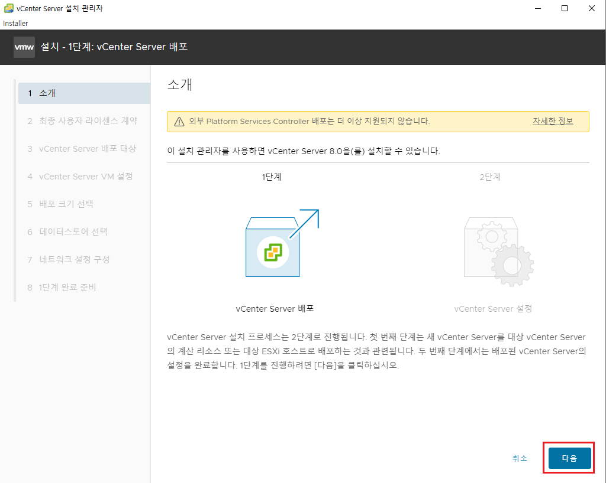
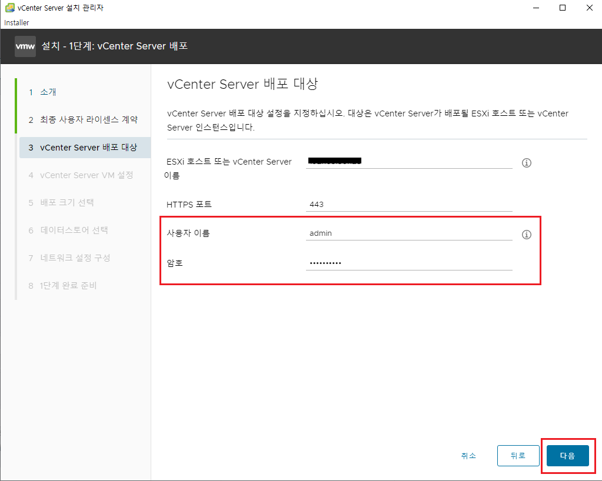
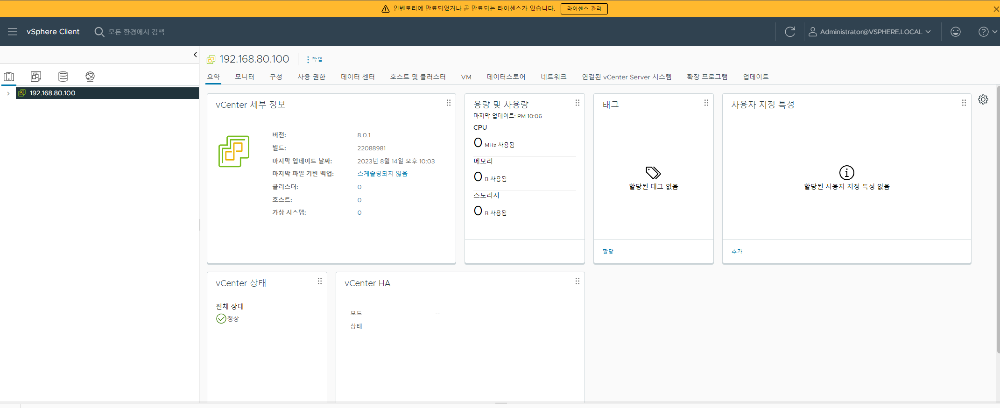

[뒤로가기](../../README.md) 

# vCenter 설치 및 ESXi 연동

 
현재 ESXi에 vCenter Server가 없다. 
그래서 vCenter Server를 설치한뒤 연동을 진행한다. 

## 시작

### (1) vCenter 설치

 

### [vSphere 8](https://customerconnect.vmware.com/en/evalcenter?p=vsphere-eval-8)

해당 링크에 들어간뒤 vCenter 8를 다운받는다. 
참고로 vCenter는 ESXi 현재 버전(7)과 같거나 높아야 된다. 
그래서 여기서는 vCenter 8 버전을 설치한다. 

 
다운이 완료되면 해당 ISO파일을 클릭한다. 

 
vcsa-ui-installer로 들어간다. 

 
각 호스트PC의 환경에 맞는 폴더로 들어간다. 

 
installer를 누른다. 

 
설치 프로그램이 실행되면, 언어를 바꾸고 싶으면 바꾸고
설치를 누른다. 

 
다음을 누른다. 

 
라이센스 체크를 누르고 다음을 누른다. 

 
ESXi의 IP를 입력하고 ESXi의 사용자 이름, 암호를 입력한다. 

 
vCenter의 이름과 암호를 입력하고 다음으로 넘어간다. 

 

현재 vCenter의 최소 리소스를 보면 
CPU2, 14GB메모리, 578GB 저장소 이다. 

### 하지만 문제는 현재 실습하는 환경이 578GB를 가진 디스크가 없다.

그래서 실습이 중단될 수 있지만, 계속 설치를 진행한다. 

 

vCenter를 설치할 데이터스토어를 지정할 수 있다. 
연결된 ESXi에 설치하는 것이다. 
여기서는 새로운 데이터스토어를 생성해 저장소를 할당하겠다. 

 
혹시 모르니 기존의 ISO, Ubuntu Storage를 모두 지우고 120GB 크기로 할당했다.
 

 
또한, 씬 디스크 모드를 사용한다. 
(실제 사용하는 용량만 할당한다. 테스트 환경일때 사용한다.) 

 
현재 vCenter는 ESXi에서 실행된다. 
그래서 IP주소도 ESXi IP주소에 맞춰 구성했다. 
ex) 192.168.80.x 

또한, 기본 게이트웨이와 DNS 서버도 ESXi의 네트워크 구성에 맞춰 구성했다. 

실제는 관리자 네트워크이기에 구성이 복잡할 수 있다. 

 
구성한 환경을 검토하고 완료를 누른다.

 
설치를 진행한다. 

 
설치가 완료되면 두번째 설치 단계로 넘어가게 된다. 
계속을 누른다. 

 
vCenter server 설정을 진행한다. 
다음으로 넘어간다. 

 
별다른 NTP 서버가 없으니 ESXi 호스트와 시간 동기화를 하고 
SSH 연결을 활성화 한다. 

 
실제 vCenter에 로그인할때 필요한 계정을 생성한다. 
여기서는 기본값인 도메인 이름을 사용했다. 

 
다음으로 넘어간다. 

 
환경 구성을 검토하고 완료한다. 

 
최종 환경 설정을 구성한다. 

 
설치가 완료되면 해당 링크로 접속한다. 

 
VSPHERE CLIENT 시작을 누른다. 

 

> administrator@vsphere.local

아까 생성한 관리자 계정명이다. 
비밀번호도 입력하고 로그인을 한다. 

 
설치가 완료되었다. 

### (2) ESXi 연동

 
vCenter를 사용하려면 먼저 데이터센터를 생성해야된다. 
새 데이터 센터를 누른다. 

 
기본값으로 두고 확인을 눌러 생성한다. 

 
생성된 데이터센터를 오른쪽 클릭한뒤,
호스트 추가를 클릭한다. 

 
연동할 ESXi 호스트의 IP주소를 입력하고 다음으로 넘어간다. 

 
ESXi에 접속이 가능한 계정과 암호를 입력하고 다음으로 넘어간다.
 

 
ESXi 호스트의 구성정보를 확인할 수 있다. 
다음으로 넘어간다. 

 
Host lifecycle은 ESXi 호스트의 소프트웨어 설치 및 업데이트를 자동으로 진행하며 관리하는 기능이다. 
체크를 하고 다음으로 넘어간다. 

 
Host lifecycle로 새 이미지를 선택하게 한다. 
기존 이미지로 유지한다. 
현재 설치된 ESXi는 7.0 U3n이다. 
찾아서 해당 버전에 맞게 설정한다. 

 
평가판을 쓰고 있으니 다음으로 넘어간다. 

 
잠금 모드가 필요없으니 사용 안함으로 하고 다음으로 넘어간다. 

 
방금 생성한 데이터센터를 선택하고 다음으로 넘어간다. 

 
구성 정보를 검토하고 완료한다. 

 
이렇게 ESXi가 vCenter랑 연결되었다.

 
실제로 ESXi 호스트의 vSphere Client로 들어가면
연결되었다 표시된다. 
