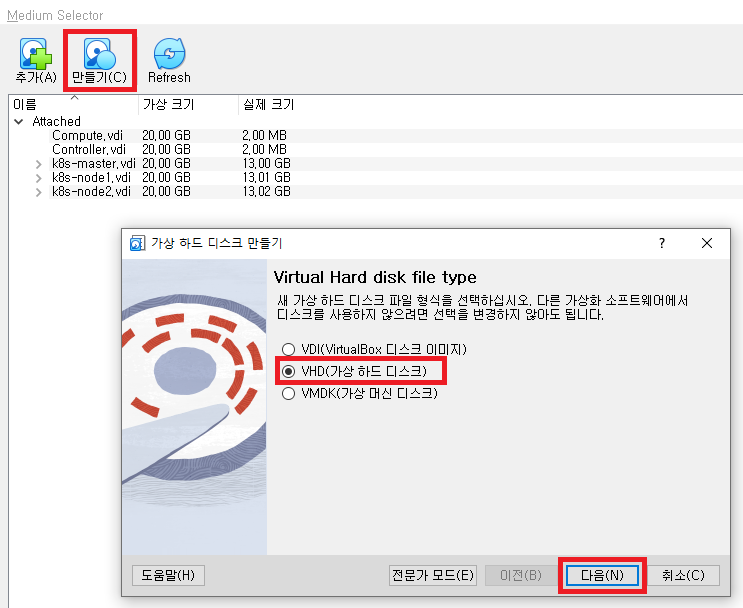
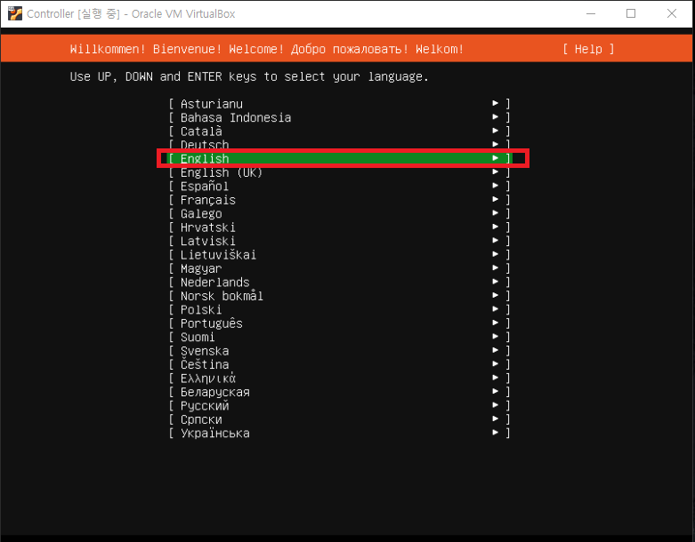
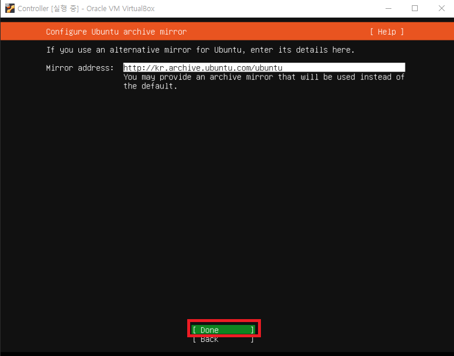
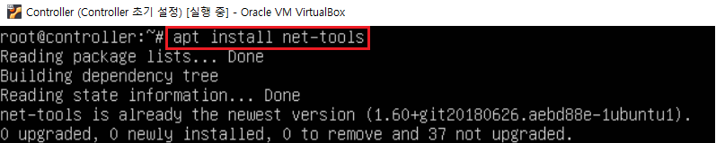
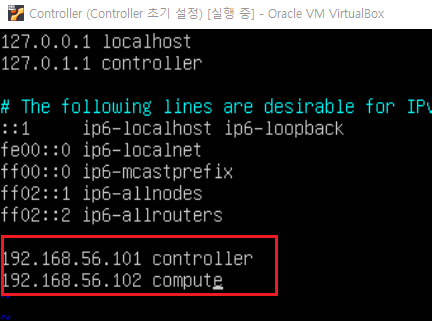
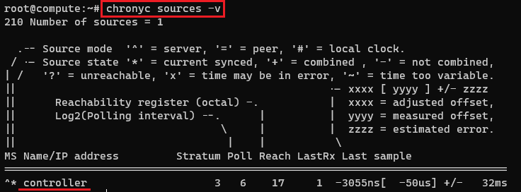

[뒤로가기](../../README.md)

# 가상 머신 생성 및 환경 설정

## 환경

1. VirtualBox

   - Controller Node

     - CPU : 2
     - Memory : 4096MB
     - Network Device : Host(enp0s3), Bridge(enp0s8), NAT(enp0s9)
     - Storage : SATA 20GB(운영체제)

   - Compute Node
     - CPU : 2
     - Memory : 5012MB
     - Network Device : Host(enp0s3), Bridge(enp0s8), NAT(enp0s9)
     - Storage : SATA 20GB(운영체제), 8GB(블록 Storage), 8GB \* 3 (오브젝트 Storage)

### (1) 가상 머신 생성 [Controller, Compute]

메모리 크기와 저장소를 제외하고 두 머신의 환경은 동일하다.  

 
 
 
 
 
 
 
 

Compute도 똑같이 생성해 만들어준다. 
여기는 Compute를 생성한 기준으로 Storage를 생성해서 Compute에 붙이는 과정이다. 

 
 
 
 
 

똑같이 오브젝트 Storage 3개를 만들어 준다. 

 
각각의 디스크를 선택한뒤 Choose를 클릭하면 Compute에 붙여진다. 

 
이렇게 구성한다. 

### (2) 우분투 설치 [Controller, Compute]

Controller 기준으로 진행한다. 

 
 
 
 
 
 
 
 
 
 
Controller와 Compute이름은 다르게 설정하자. 
나중에 헷갈릴 수 잇다. 
 
 

 
설치가 완료되면 초기 상태로 스냅샷을 저장해두자. 

### (3) 네트워크 설정 [Controller, Compute]

### [Controller]

 

> sudo apt-get update 
> sudo su 

패키지 업데이트를하고 관리자 계정으로 들어간다. 

 

> apt install net-tools 

ifconfig 명령어를 위해 net-tools를 설치한다. 

 

> apt install ifupdown

우분투 20.04의 네트워크 인터페이스 설정은 netplan방식이다. 
하지만 여기서는 netplan이 아닌 interface 방식으로 설정할것이다. 
ifupdown을 설치한다. 

 

> vi /etc/netplan/00-installer-config.yaml

해당 파일을 연다. 

 

모든 내용을 #으로 주석처리한뒤 저장한다.

 

> apt-get update

다시 패키지를 업데이트한다.

 

> vi /etc/network/interfaces

interfaces파일을 연다.

 

> auto enp0s3 
> iface enp0s3 inet static 
> address 192.168.56.101 
>
> auto enp0s8 
> iface enp0s8 inet manual 
> up ip link set dev $IFACE up 
> down ip link set dev $IFACE down  
>
> auto enp0s9 
> iface enp0s9 inet dhcp 

해당 위치에 다음과 같이 입력하고 저장한다.

---

### code 설명

auto enp0s3 
부팅시 자동으로 인터페이스를 활성화한다. 

iface enp0s3 inet static 
정적 IP주소로 구성한다. 

iface enp0s8 inet manual 
해당 인터페이스를 수동으로 구성한다. 
enp0s8을 수동으로 구성하면서 다른 스트립트에서 인터페이스를 설정할 수 있다. 
대체로 가상 네트워크 환경같이 유연한 네트워크 구성을 위해 사용한다. 

up ip link set dev $IFACE up, down ip link set dev $IFACE down 
수동으로 전환했기에 서버 부팅(다운)시에 인터페이스를 활성화하라는 명령어를
작성해야한다. 

iface enp0s9 inet dhcp 
DHCP 서버로 IP 주소를 동적으로 할당받는다. 
DHCP : 네트워크에서 IP 주소와 관련된 구성 정보를 동적으로 할당하기 위해 사용되는 프로토콜 

---

 

> systemctl unmask networking 
> systemctl enable networking 
> systemctl restart networking 

networking을 활성화 한뒤 우분투 머신을 재시작한다.

 

> ifconfig

enp0s3의 ip가 변경되었는지 확인한다. 

 

> vi /etc/hosts

hosts파일을 연다. 

 

매핑테이블에 controller와 compute의 네임서버를 등록한다. 

Compute또한 해당 과정을 수행한다. 
단, vi /etc/network/interfaces은 

### [Compute - interfaces]

> auto enp0s3 
> iface enp0s3 inet static 
> address 192.168.56.102 
>
> auto enp0s8 
> iface enp0s8 inet manual 
> up ip link set dev $IFACE up 
> down ip link set dev $IFACE down  
>
> auto enp0s9 
> iface enp0s9 inet dhcp 

다음과 같이 입력한다.

### (4) 네트워크 테스트 [Controller, Compute]

 

> ssh controller@192.168.56.101 
> ssh compute@192.168.56.102 

SSH로 모든 서버에 연결이 되는지 확인한다. 

 

> ping 8.8.8.8 

8.8.8.8로 ping을 전송하는지 확인한다. 

 

[controller] 

> ping compute 

[compute] 

> ping controller 

서로 ping을 전송하는지 확인한다. 

### (5) 네트워크 타임 맞추기 [Controller, Compute]

openstack에는 compute node와 controller node가 서로 연동하며
서비스를 수행한다. 
하지만, 각자 노드끼리의 시간이 서로 맞지 않으면 controller node에서
인스턴스를 생성할때 문제가 발생한다. 
그래서 각 서버들의 시간을 맞춘다. 

### [Controller]

 

> apt-get install chrony 

시간 동기화 패키지 chrony를 설치한다. 

 

> vi /etc/chrony/chrony.conf

chrony 설정 파일로 들어간다. 

 

> server 0.pool.ntp.org iburst 
> server 1.pool.ntp.org iburst 
> server 2.pool.ntp.org iburst 
> server 3.pool.ntp.org iburst 
>
> allow 0/0 

첫번째 네모박스를 주석처리하고 그 밑에 입력한다.  

---

### code 설명

pool.ntp.org 
NTP를 사용하여 정확한 시간 정보를 제공하는 NTP서버 풀이다. 
그래서 시스템은 정확한 시간 정보를 가져와 동기화할 수 있다. 

iburst 
최초 요청시 빠른 시간 동기화를 수행하기 위해 사용되는 옵션이다. 

allow 0/0 
방화벽 설정에서 사용되는 규칙이다. 
이 규칙은 모든 IP주소, 네트워크로부터 접근을 허용한다는 뜻이다. 
controller가 다른 노드와 동기화를 하려면 추가해야한다. 

---

 

> service chrony restart 
> chronyc sources -v 

chrony를 재시작하고 실행하는지 확인한다. 

### [Compute - chrony.conf]

compute 노드도 똑같이 설치를 진행하지만, 
chrony.conf는 
 

> server 192.168.56.101 iburst 

입력해준다. 

 

chrony를 재시작하고 

> chronyc sources -v

으로 controller가 리스트에 있는지 확인한다. 
