[뒤로가기](./EC2.md)

(1) 터미널 설치

### [Windows Terminal](https://apps.microsoft.com/store/detail/windows-terminal/9N0DX20HK701?hl=ko-kr&gl=kr&activetab=pivot%3Aoverviewtab)

(2) OpenSSH 활성화 
 
 
 
(OpenSSH 클라이언트가 설치 되어 있는지 확인 없을시 설치하고 재부팅) 

(3) Pem키 .SSH 폴더에 저장 및 설정 
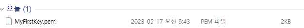 
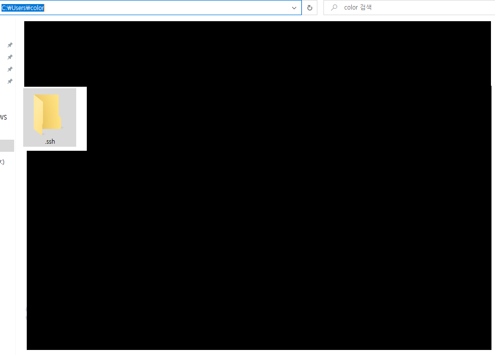 
(내 사용자 계정 폴더로 이동 후 .ssh 폴더가 없을 경우 생성) 
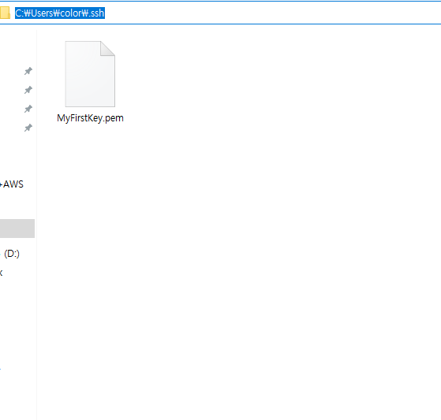 
(해당 PEM키 .ssh폴더에 저장) 
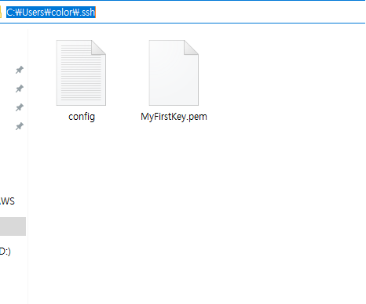 
(config 텍스트 파일 .ssh폴더에 생성)

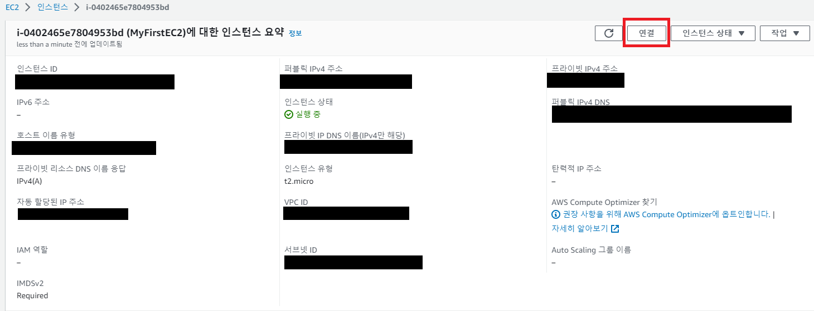 
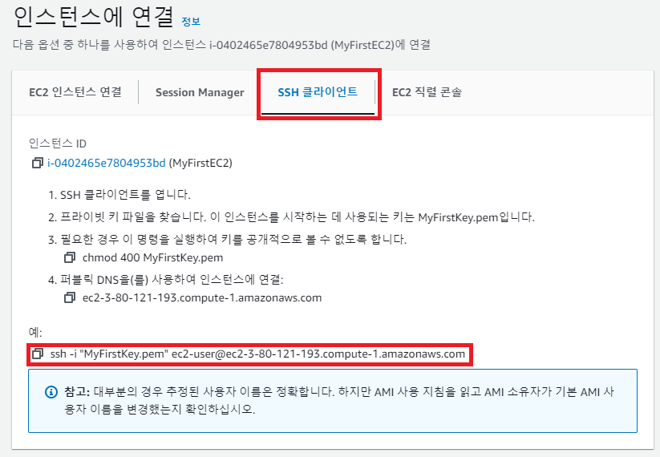 
(연결할 인스턴스의 SSH 명령어 확인) 

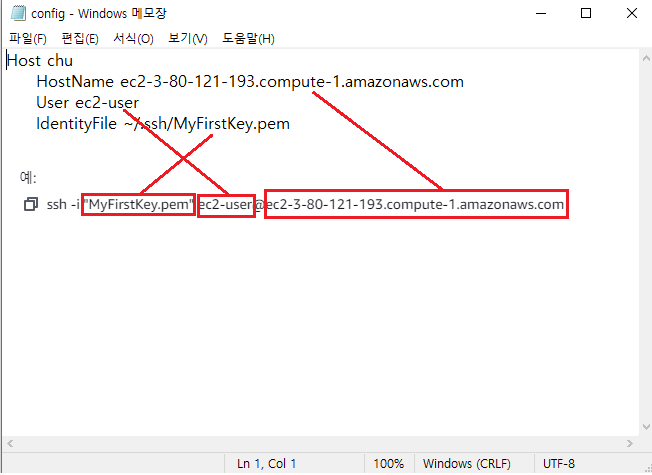 
(config에 SSH 명령어 텍스트에 맞춰 입력
Host는 접속할시 별칭이기에 원하는 대로 입력후 저장) 

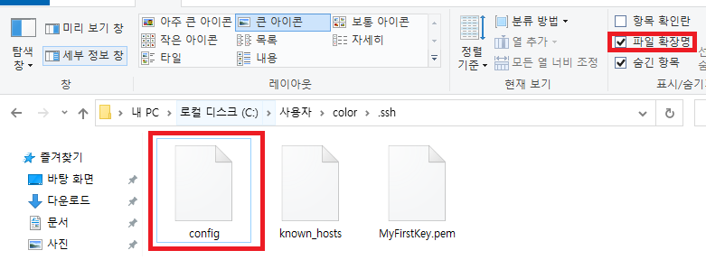 
(파일 확장명 체크 및 config.txt를 config로 변경)

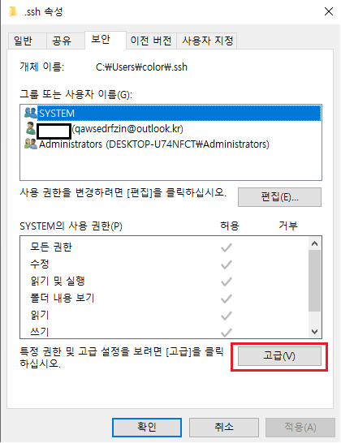 
(해당 폴더 속성으로 이동한뒤 보안에서 고급 클릭) 
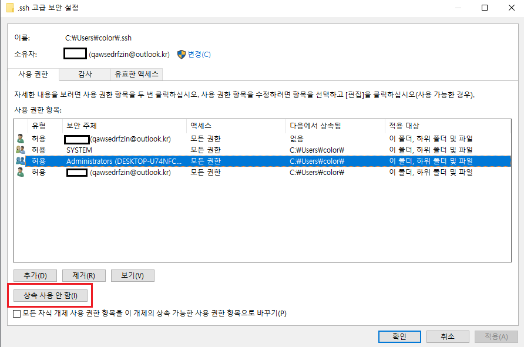 
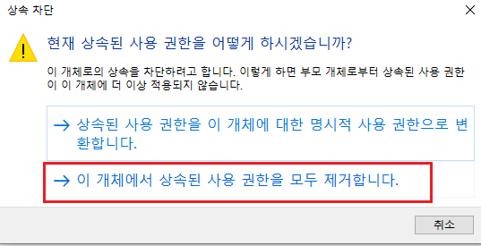 
(적용 및 확인 후 나가기) 
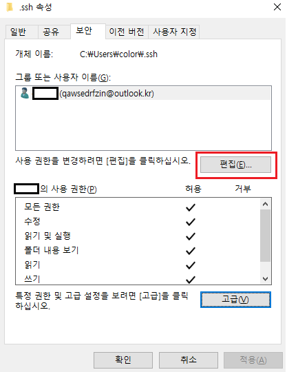 
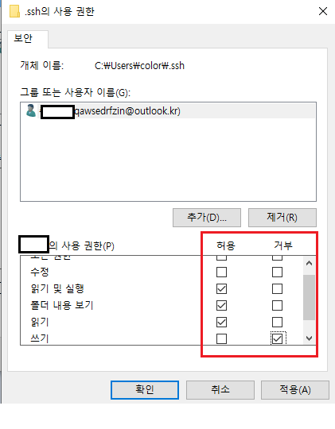 

(4) 관리자 권한으로 터미널 실행 

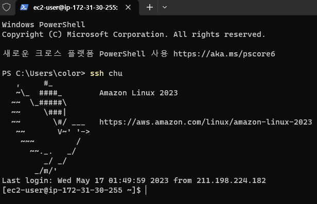 
(ssh 별칭 으로 접속)
