# Jenkins

[뒤로가기](./)\

## Jenkins

지속적인 통합(CI) , 지속적인 배포(CD) 환경을 구축하기 위한 도구\
빌드, 테스트, 배포 프로세스를 자동화하여 소프트웨어 품질과 개발 생산성을 높일 수 있다.\

### 설치

#### 환경

1. 우분투 22.04
2. java 11

#### (1) JDK 설치

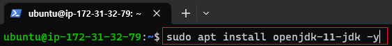\
(현재 jenkins는 java 11버전이 필요하다.)\

#### (2) Jenkins 저장소 key 등록

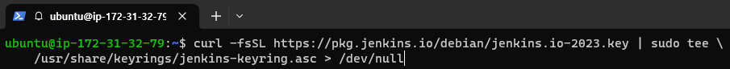\
curl -fsSL https://pkg.jenkins.io/debian/jenkins.io-2023.key | sudo tee \\\
/usr/share/keyrings/jenkins-keyring.asc > /dev/null

#### (3) apt 저장소에 추가

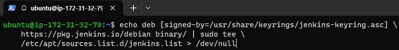\
echo deb \[signed-by=/usr/share/keyrings/jenkins-keyring.asc] \\\
https://pkg.jenkins.io/debian binary/ | sudo tee \\\
/etc/apt/sources.list.d/jenkins.list > /dev/null

#### (4) 패키지 업데이트

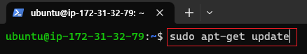\

#### (5) jenkins 설치

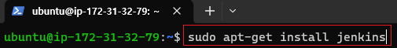\

\[참고] [설치가 느릴겨우](etc/Linux.md)

#### (6) 설치 확인

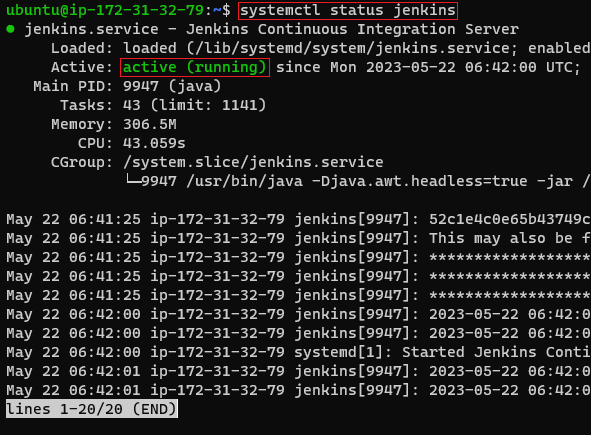\

#### (7) 접속 및 환경 설정

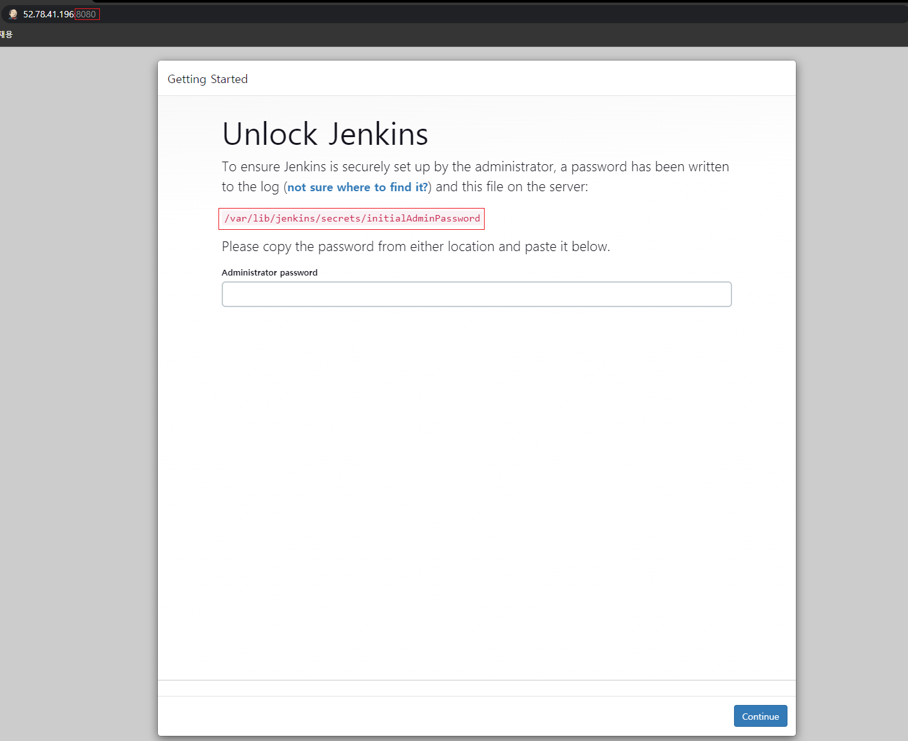\
(젠킨스 서버 포트는 기본적으로 8080이다.\
자신의 IP:8080 으로 접속하자.\
그리고 다음과 같은 화면에서\
/var/lib/jenkins/secrets/initialAdminPassword 해당 줄을 복사한다.)\

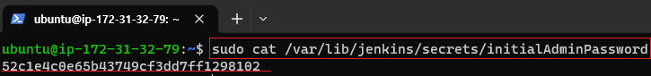\
(파일의 내용을 출력하면 다음과 같은 암호가 나온다.\
해당 암호를 방금전 사이트에 복사해서 붙여넣는다. )\

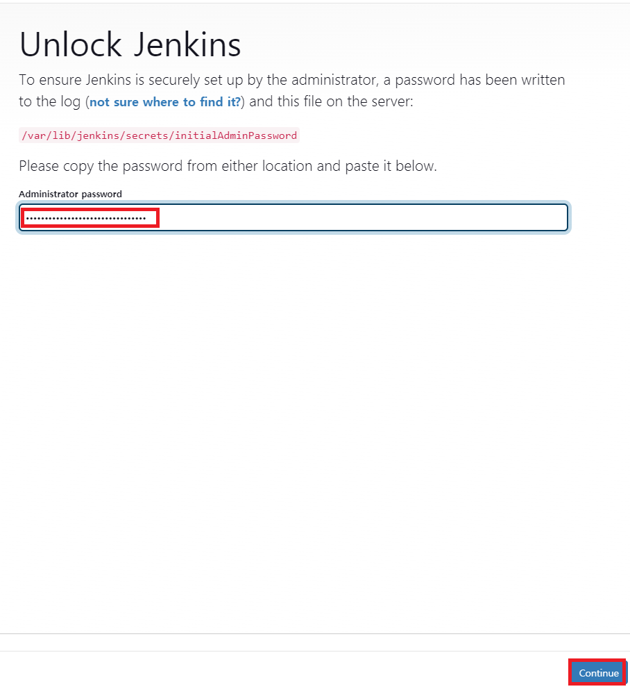\

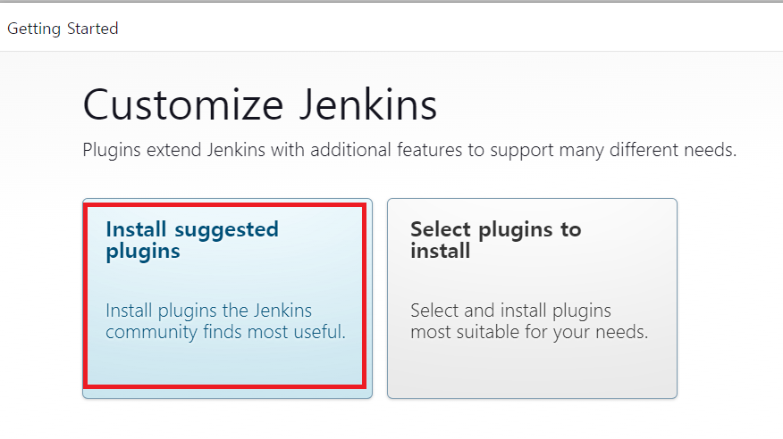\
(플러그인 설치 화면이다. 일단, 추천하는 플러그인으로 설치한다.)\

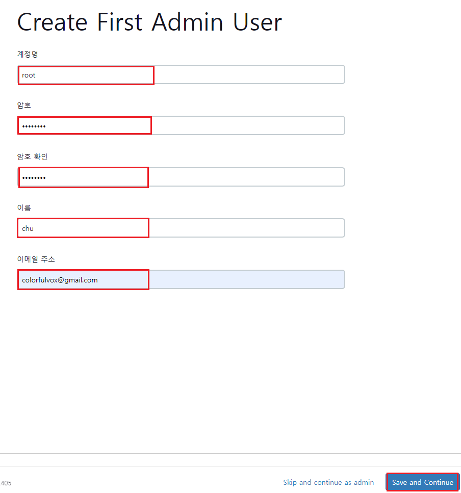\
(설치가 완료되면 계정을 생성해준다.)\

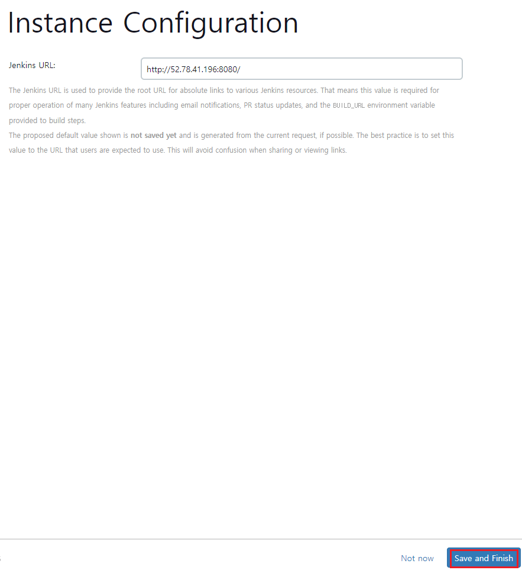\
(젠킨스 URL 접속 주소이다. 기본으로 둔다.)\

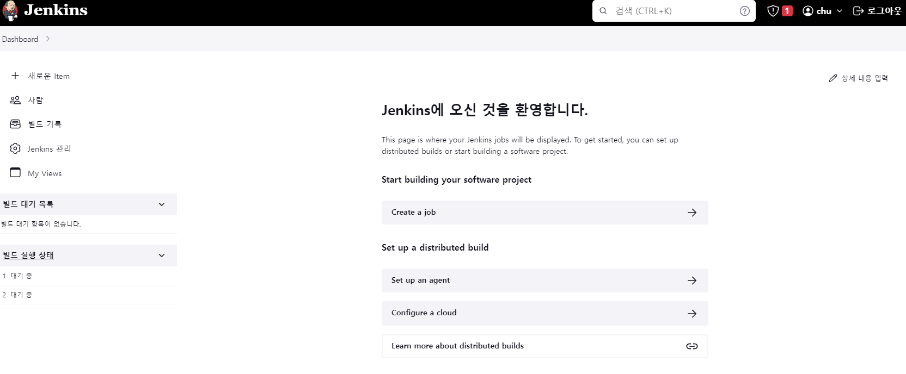\
(설치 완료)\
