# Devstack

[뒤로가기](../)\

## Devstack 설치

#### 1. stack계정 생성

Devstack을 설치하려면 stack계정이 필요하다.\

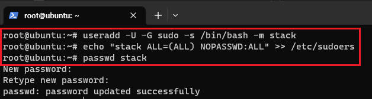\

> useradd -U -G sudo -s /bin/bash -m stack\
>

sudo 권한이 있는 stack 계정을 추가한다.\

> echo "stack ALL=(ALL) NOPASSWD:ALL" >> /etc/sudoers\
>

패스워드를 입력하지않고도 sudo를 사용할 수 있게 설정한다.\

> passwd stack\
>

stack계정의 패스워드를 설정한다.\

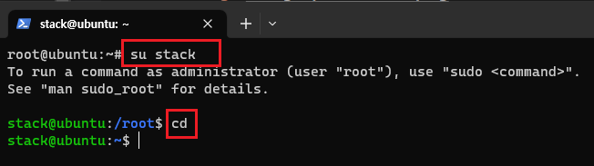\

> su stack\
> cd\
>

stack 계정으로 전환한다.\

#### 2. devstack 환경 설정 및 설치

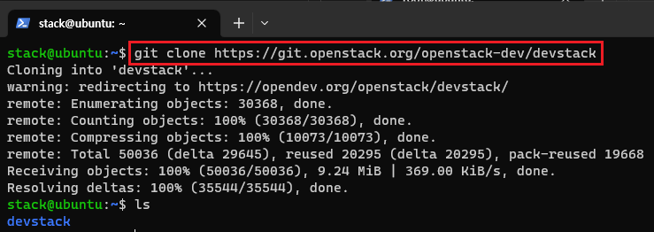\

> git clone https://git.openstack.org/openstack-dev/devstack\
>

git 명령어로 devstack를 다운받는다.\

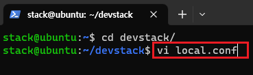\

> cd devstack/\
> vi local.conf\
>

devstack 폴더로 이동한뒤 local.conf를 연다.\
오픈스택의 기본 정보와 nova-network 서비스를 비활성화, Neutron 서비스를 활성화한다.\

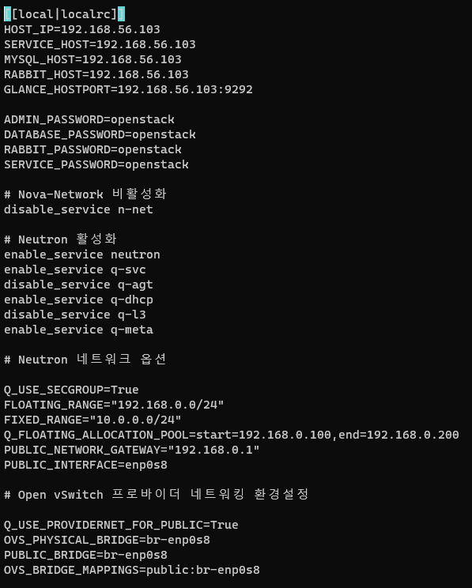\

> \[\[local|localrc]]\
> HOST\_IP=192.168.56.103\
> SERVICE\_HOST=192.168.56.103\
> MYSQL\_HOST=192.168.56.103\
> RABBIT\_HOST=192.168.56.103\
> GLANCE\_HOSTPORT=192.168.56.103:9292\
>
>
> ADMIN\_PASSWORD=openstack\
> DATABASE\_PASSWORD=openstack\
> RABBIT\_PASSWORD=openstack\
> SERVICE\_PASSWORD=openstack\
>
>
> \# Nova-Network 비활성화\
> disable\_service n-net\
>
>
> \# Neutron 활성화\
> enable\_service neutron\
> enable\_service q-svc\
> disable\_service q-agt\
> enable\_service q-dhcp\
> disable\_service q-l3\
> enable\_service q-meta\
>
>
> \# Neutron 네트워크 옵션\
>
>
> Q\_USE\_SECGROUP=True\
> FLOATING\_RANGE="192.168.0.0/24"\
> FIXED\_RANGE="10.0.0.0/24"\
> Q\_FLOATING\_ALLOCATION\_POOL=start=192.168.0.100,end=192.168.0.200\
> PUBLIC\_NETWORK\_GATEWAY="192.168.0.1"\
> PUBLIC\_INTERFACE=enp0s8\
>
>
> \# OpenVSwitch 프로바이더 네트워킹 환경설정\
>
>
> Q\_USE\_PROVIDERNET\_FOR\_PUBLIC=True\
> OVS\_PHYSICAL\_BRIDGE=br-enp0s8\
> PUBLIC\_BRIDGE=br-enp0s8\
> OVS\_BRIDGE\_MAPPINGS=public:br-enp0s8\
>

다음과 같이 입력한다.\

FLOATING\_RANGE는 Public IP 대역을 말하며 VM이 생성될때 처음 할당받는\
Private IP는 Fixed IP이며 동적으로 할당하여 외부 인터넷과 통신 할 수 있는\
IP가 FLOATING IP이다.

Q\_USE\_SECGROUP=True -> 보안 그룹 사용을 허용\
\
FLOATING\_RANGE="192.168.0.0/24 -> 외부 네트워크로 사용될 enp0s8 IP범위 설정\
\
Q\_FLOATING\_ALLOCATION\_POOL=start=192.168.0.100,end=192.168.0.200\
\-> FLOATING IP 범위에서 인스턴스에 할당할 IP범위를 설정\
\
PUBLIC\_NETWORK\_GATEWAY="192.168.0.1"\
\-> FLOATING IP 범위의 실제 물리 게이트웨이 보통 게이트웨이는 자신의 IP에서 마지막 값인 1로 설정한다.\
\
PUBLIC\_INTERFACE=enp0s8 -> FLOATING IP가 사용할 실제 물리 네트워크 디바이스\
\
OVS\_PHYSICAL\_BRIDGE=br-enp0s8\
PUBLIC\_BRIDGE=br-enp0s8\
OVS\_BRIDGE\_MAPPINGS=public:br-enp0s8\
\-> 네트워크 브릿지 이름 설정\

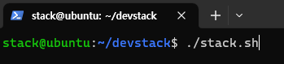\

> ./stack.sh

stack.sh을 실행해 devstack을 설치한다.

#### \[트러블 슈팅]

설치 관련해서 오류가 많다.\
오류가 날경우,\

1. ./unstack.sh을 하여 서비스 관련 구성 및 네트워크를 정리한다.
2. ./clean.sh을 하여 openstack 관련 남은 파일을 모두 삭제한다.
3. sudo apt-get update로 패키지를 업데이트 해준다.

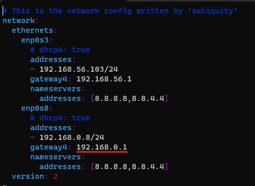\
vi /etc/netplan의 yaml파일이 정확하게 입력되었는지 그리고\
local.conf의 PUBLIC\_NETWORK\_GATEWAY="192.168.0.1"이 제대로 입력되었는지 확인한다.\

\[설치중 git clone에서 멈추고 종료]\
local.conf에\

> GIT\_BASE=${GIT\_BASE:-https://git.openstack.org}

를 추가한다.\
하지만, 안될 수 있다.\
그래서 다시 unstack.sh를 하고 stack.sh으로 다시 설치하면서 될때까지 하면 되긴 한다.\

다른 오류관련해서는 구글링을 해야된다.\
(ChatGPT에 물어보면 도움이 된다.)\

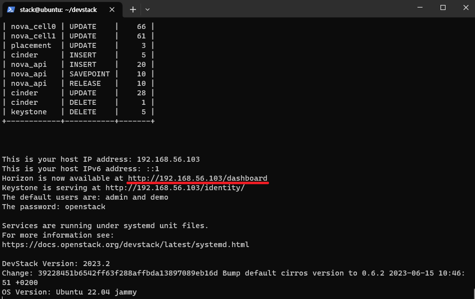\
설치완료 화면이다.\
설치가 완료되면 http://192.168.56.103/dashboard 와같이 openstack 대쉬보드 URL을 출력해준다.\

실제로 접속하면,\
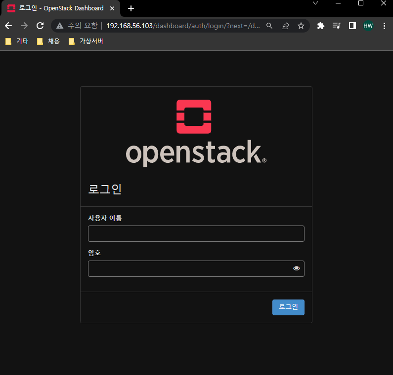\
접속이 되는것을 확인할 수 있다.\

#### \[중요]

현재 상태를 스냅샷으로 저장해두자.\

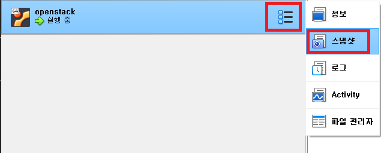\
해당 가상 머신을 오른쪽 클릭한뒤 스냅샷을 클릭한다.

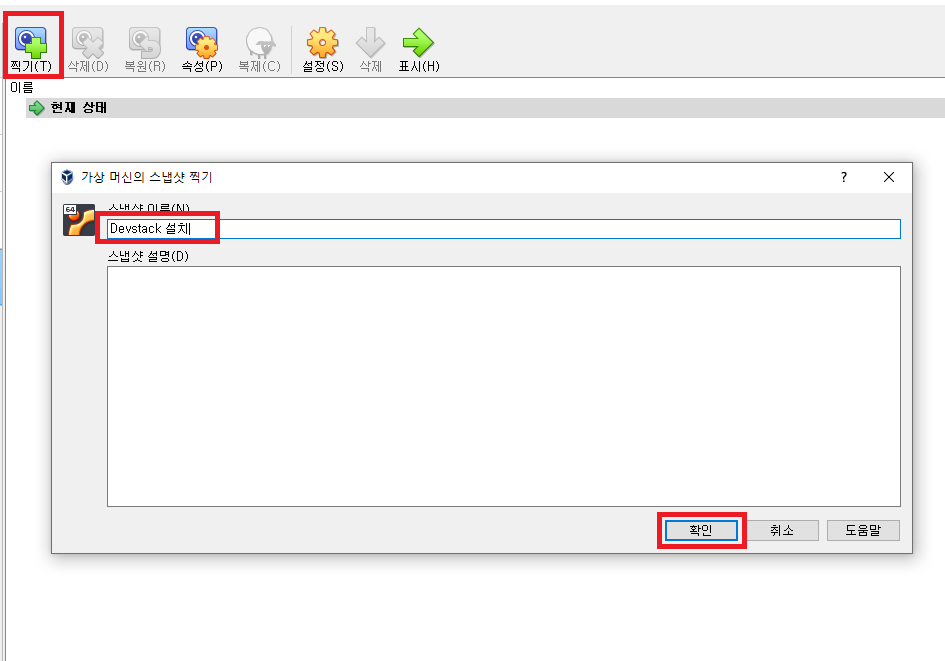\
찍기를 누른뒤 다음과 같이 입력한뒤 확인을 누른다.\
