# openstack-vmset

[뒤로가기](../)\

## OpenStack 가상 머신 설정

#### 1. VM 구성 및 우분투 설치

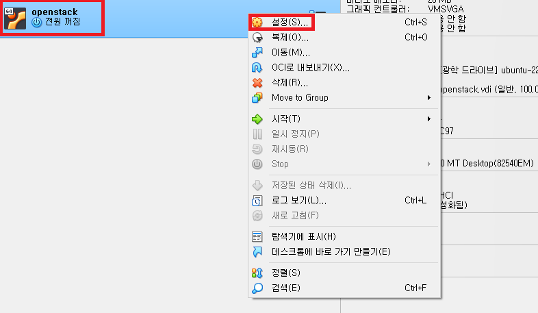\
생성한 VM을 오른쪽 클릭해 설정을 누른다.

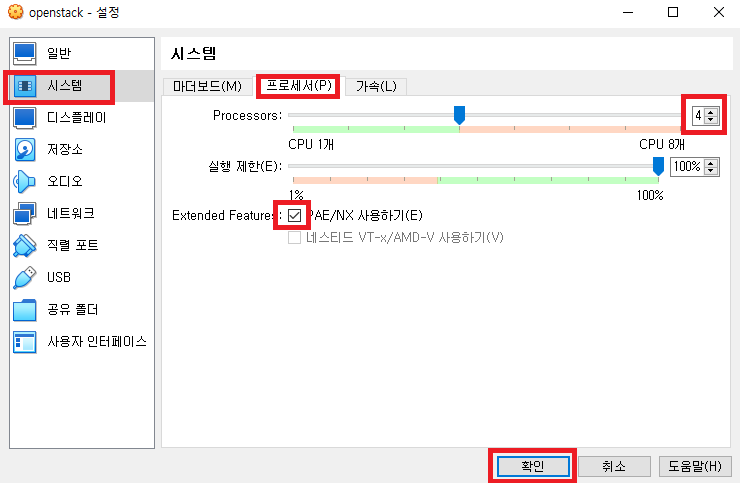\
시스템 - 프로세서로 들어간뒤,\
프로세서 개수를 4개로 설정한다.\
그리고 PAE/NX 사용하기를 체크한다.\

> PAE/NX - 호스트 CPU의 물리적 주소 확장 기능을 가상 머신에서 쓸 수 있다.\
>

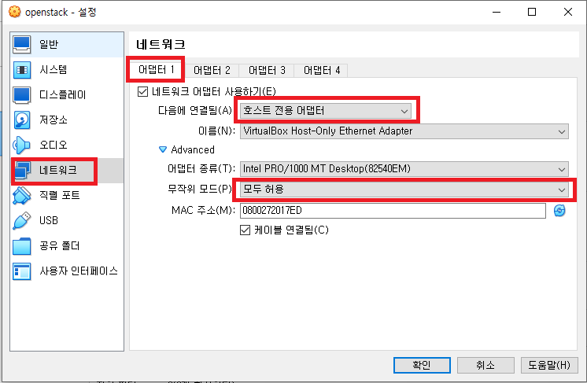\
네트워크 -> 어댑터1로 들어간뒤,\
호스트 전용 어댑터로 바꾸고 무작위 모드를 모두 허용으로 체크한다.\

> 해당 어댑터는 서버의 enp0s3이며 관리용 네트워크로 쓴다.\
>

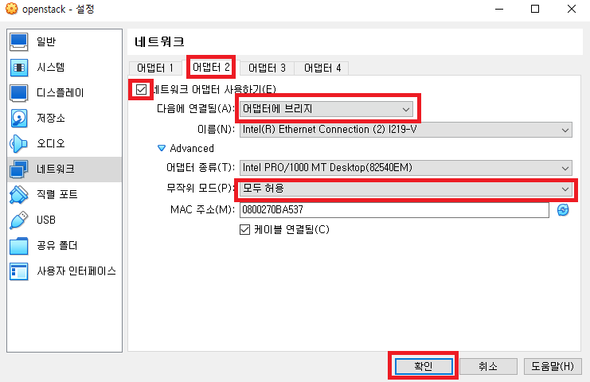\
어댑터2에서 네트워크 어댑터 사용하기를 클릭한뒤,\
어댑터에 브리지, 모두 허용을 선택한다.\

> enp0s8이며 외부 통신용 네트워크로 쓴다.

#### 가상 서버를 실행한다.

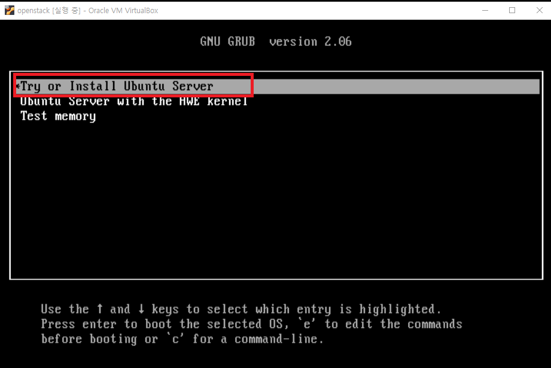\
엔터한뒤 설치를 진행한다.\

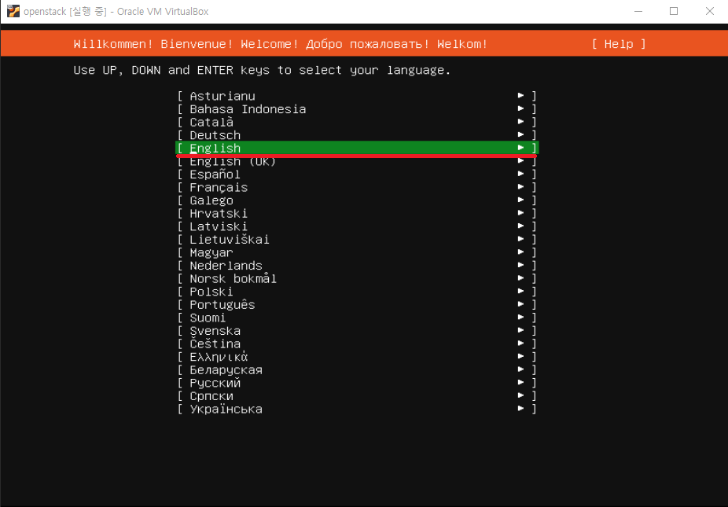\
영어를 선택한다.\

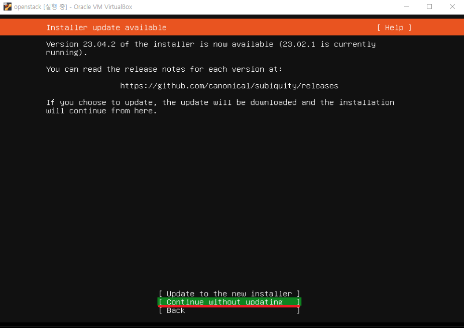\
버전 업데이트없이 계속한다.\

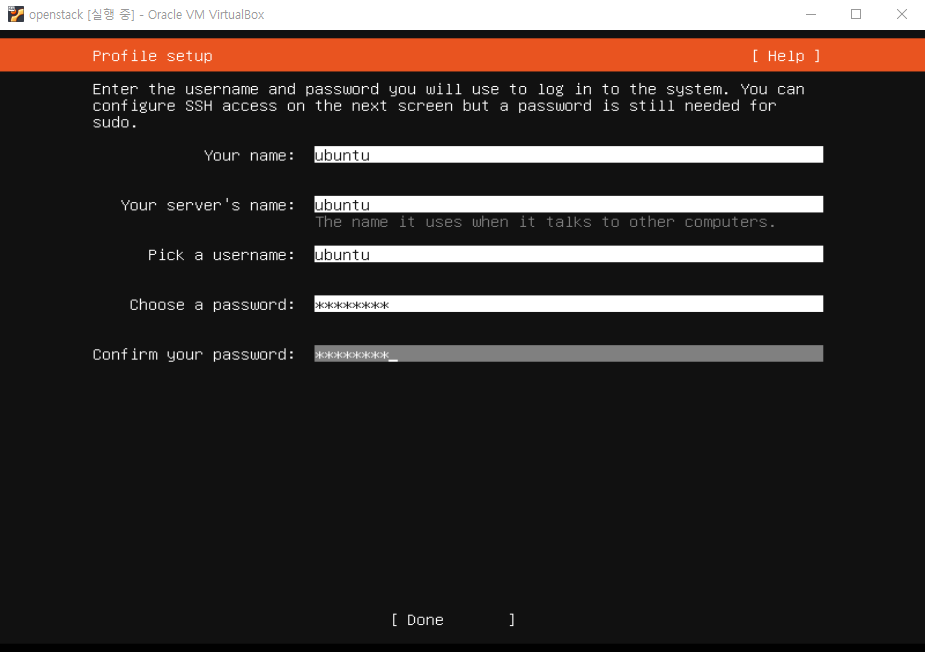\
해당 화면이 나올때까지 done한다.\
그리고 입력해주고 Done한다.\

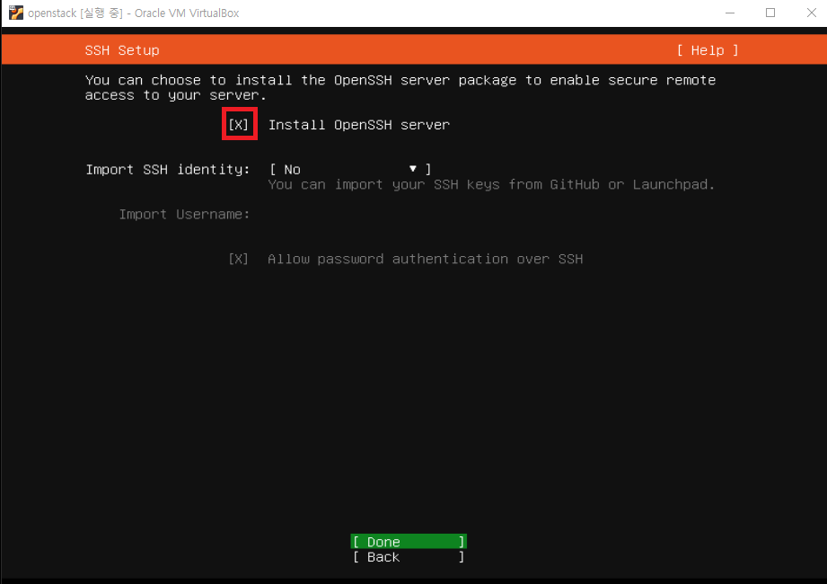\
OpenSSH 설치 관련이다.\
체크한뒤 Done한다.\

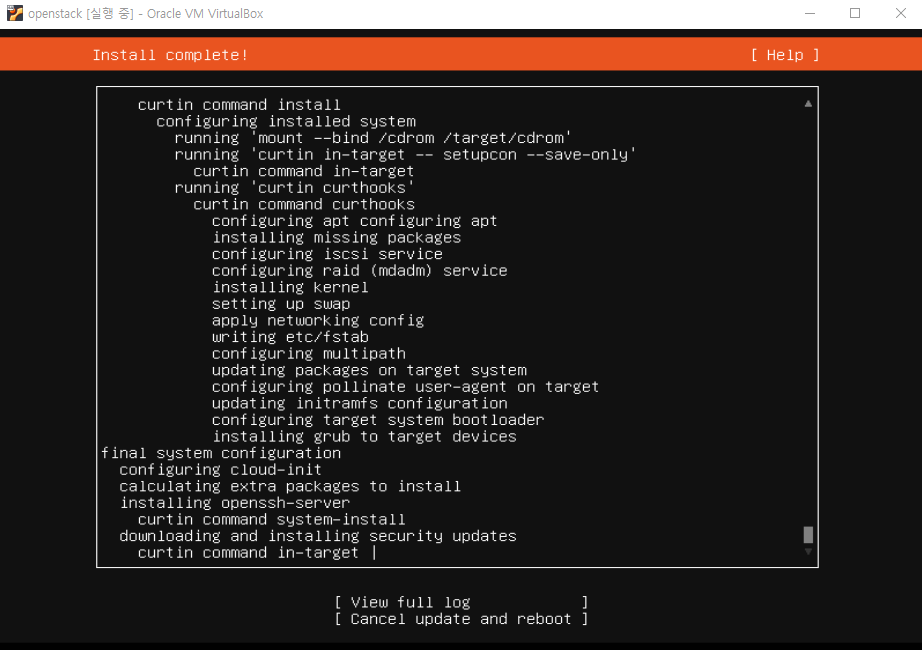\
설치될때까지 기다린다.\

#### 설치가 완료되면 Reboot를 눌러 재시작을 한다.

\

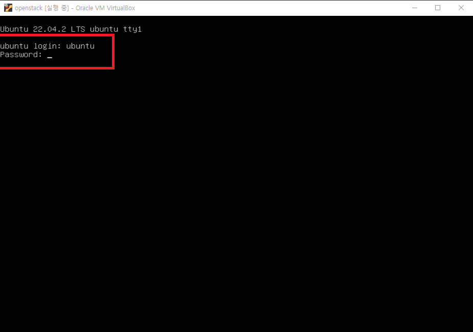\
로그인 화면이 나오면 아까 입력한 ubuntu를 입력하고 패스워드도 입력한다.\

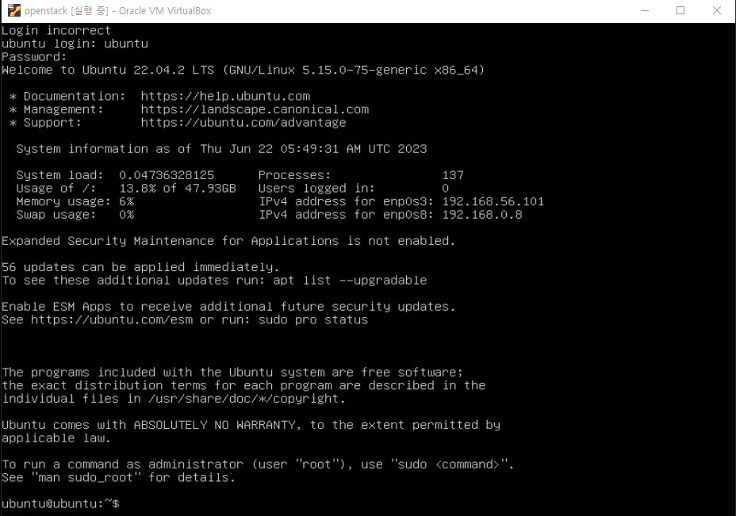\
로그인 완료 화면이다.\

#### 2. SSH 연결

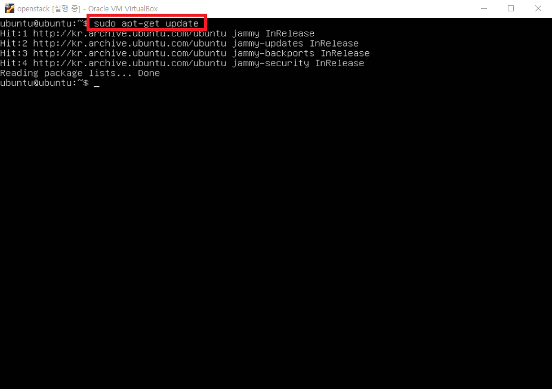\

> sudo apt-get update

업데이트를 한다.\

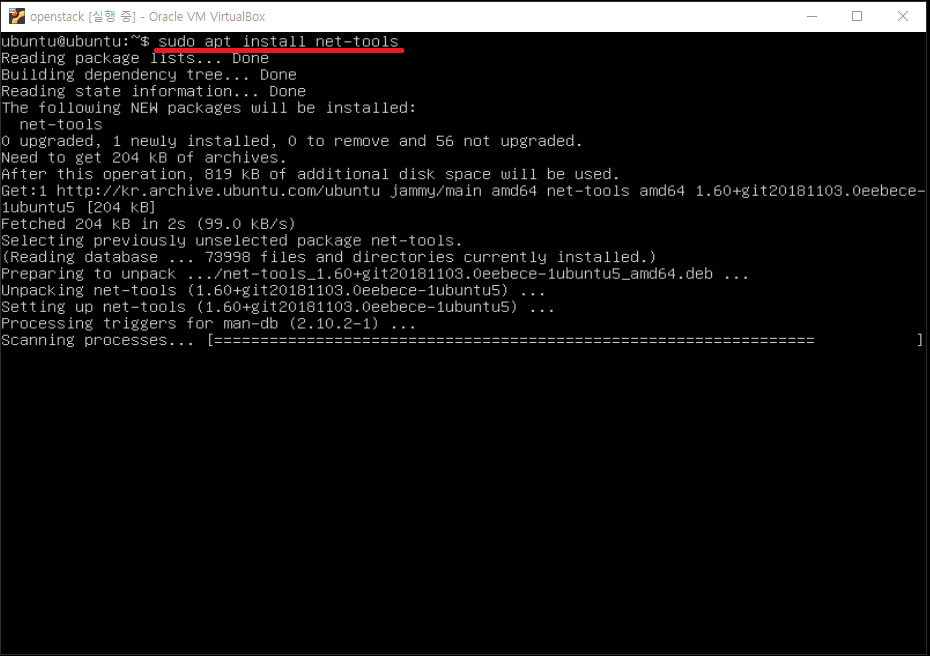\

> sudo apt install net-tools

ifconfig 명령어를 사용하기위해 net-tools를 설치한다.\

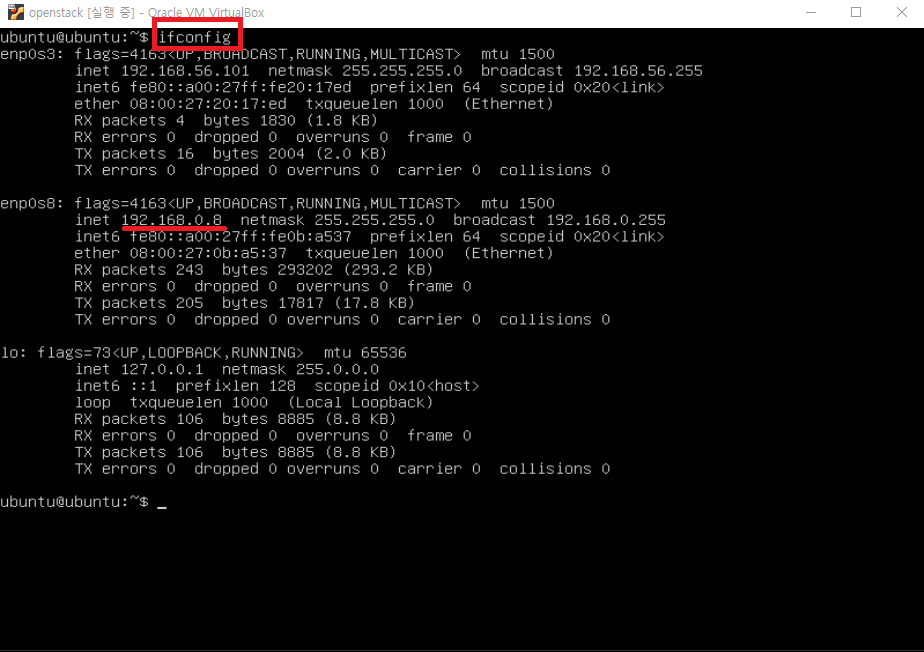\

> ifconfig

enp0s8의 아이피를 확인한뒤, 호스트에서 터미널을 연다.\

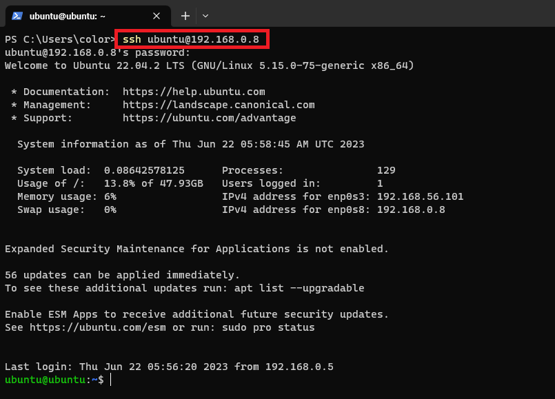\

> ssh ubuntu@IP

입력해 접속한다.\

#### 윈도우 SSH 설정은 [윈도우 터미널](../etc/터미널.md)을 확인한다.

#### 3. 네트워크 설정

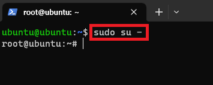\

> sudo su -

관리자 계정으로 들어간다.\

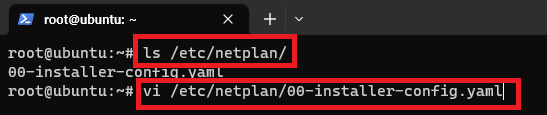\

> ls /etc/netplan/

으로 yaml파일을 확인한뒤 vi로 연다.\

> vi /etc/netplan/\*.yaml

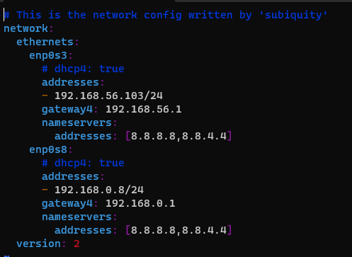\
다음과 같이 변경해준다.

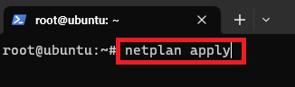\

> netplan apply

네트워크를 초기화해준다.

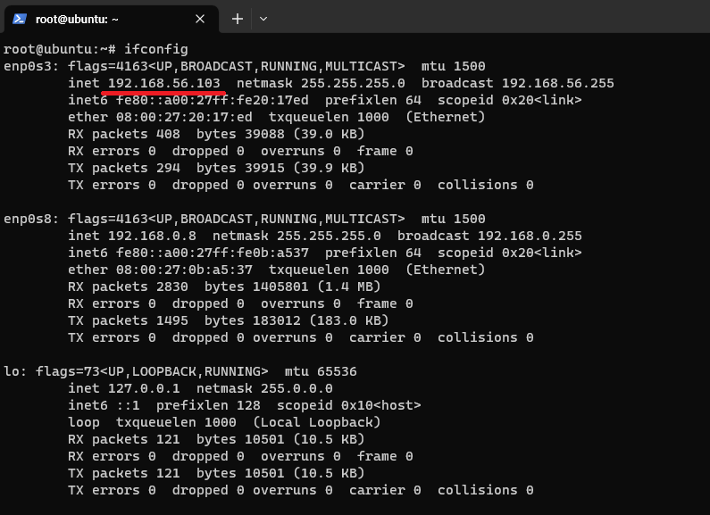\

> ifconfig

변경된것을 확인할 수 있다.\

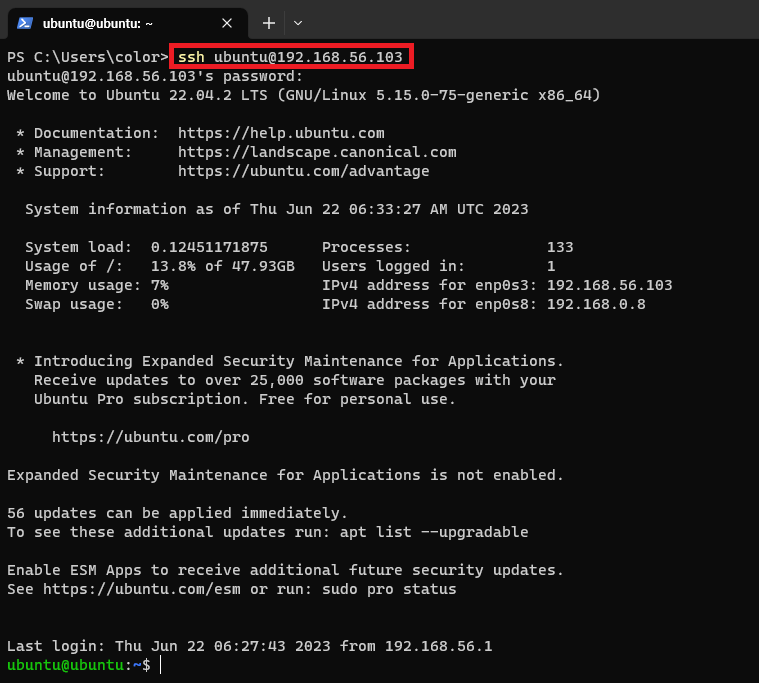\

또한, 해당 IP로 SSH 연결이되는지도 확인한다.

#### 해당 IP인 enp0s3는 관리용 IP로 SSH접속, 대시보드 접속, API 접속에 사용할 것이다.

### Neutron 네트워크 옵션

Q\_USE\_SECGROUP = True FLOATING\_RANGE = "192.168.0.0/24" FIXED\_RANGE = "10.0.0.0/24" Q\_FLOATING\_ALLOCATION\_POOL=start=192.168.0.100,end=192.168.0.200 PUBLIC\_NETWORK\_GATEWAY = "192.168.0.1" PUBLIC\_INTERFACE = enp0s8
