# GithubActions+Docker \[SpringBoot]

[뒤로가기](../)\


## GithubActions+Docker \[SpringBoot]

Github Actions가 프로젝트 소스를 받아 Docker 이미지로 빌드한뒤\
DockerHub에 저장하고 저장한 이미지를 EC2에서 이미지를 실행해 배포\


### 구성도

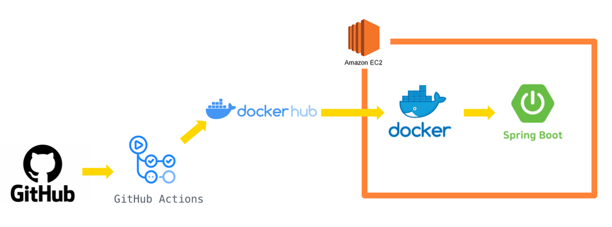

### 사전 세팅

1. AWS EC2 Ubuntu 생성 및 환경 설정 [AWS EC2 생성](../AWS/EC2.md)
2. Springboot 프로젝트 생성 및 Dockerfile 저장 [SpringBoot 프로젝트 생성](<Local \[SpringBoot].md>) [Dockerfile 생성](../Data/Document/Docker%20\[SpringBoot].md)
3. SpringBoot 프로젝트 Github에 저장
4. ubuntu에 도커 설치 및 레파지토리 생성 [Docker 설치](../Docker.md)

### 환경

[Java SE-17](https://www.oracle.com/java/technologies/javase/jdk17-archive-downloads.html)\
VSCode\


1. Spring Boot Extension Pack
2. Extension Pack for Java
3. Gradle for Java

EC2 - Ubuntu (AWS EC2 생성 과정 참조) [EC2](../AWS/EC2.md)

### 시작

시작전에\
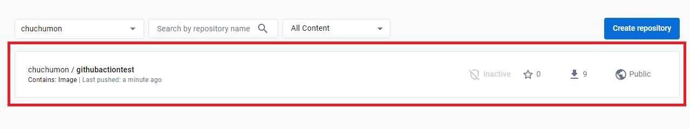 본인 Dockerhub에 레파지토리를 생성한다.\


#### workflow 생성

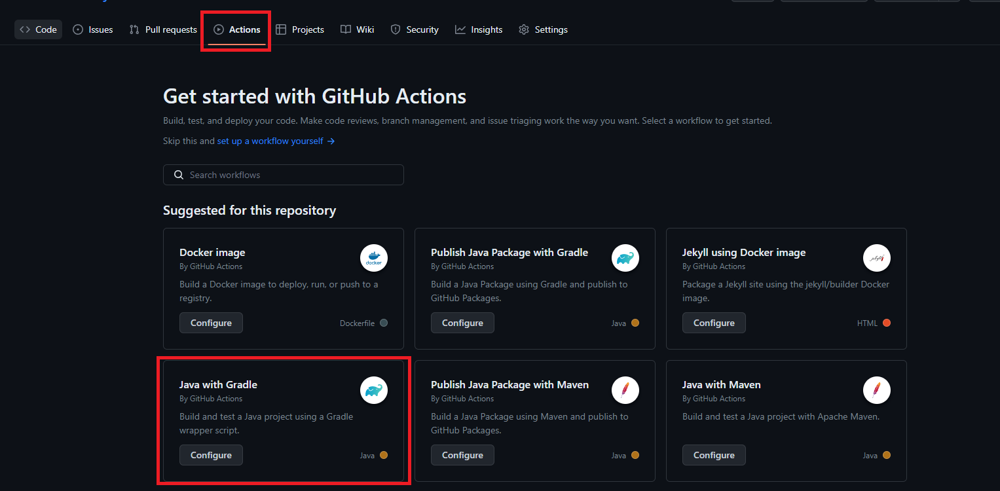 (본인 SpringBoot 프로젝트에서 Action -> Java with Gradle를 선택한다.)\


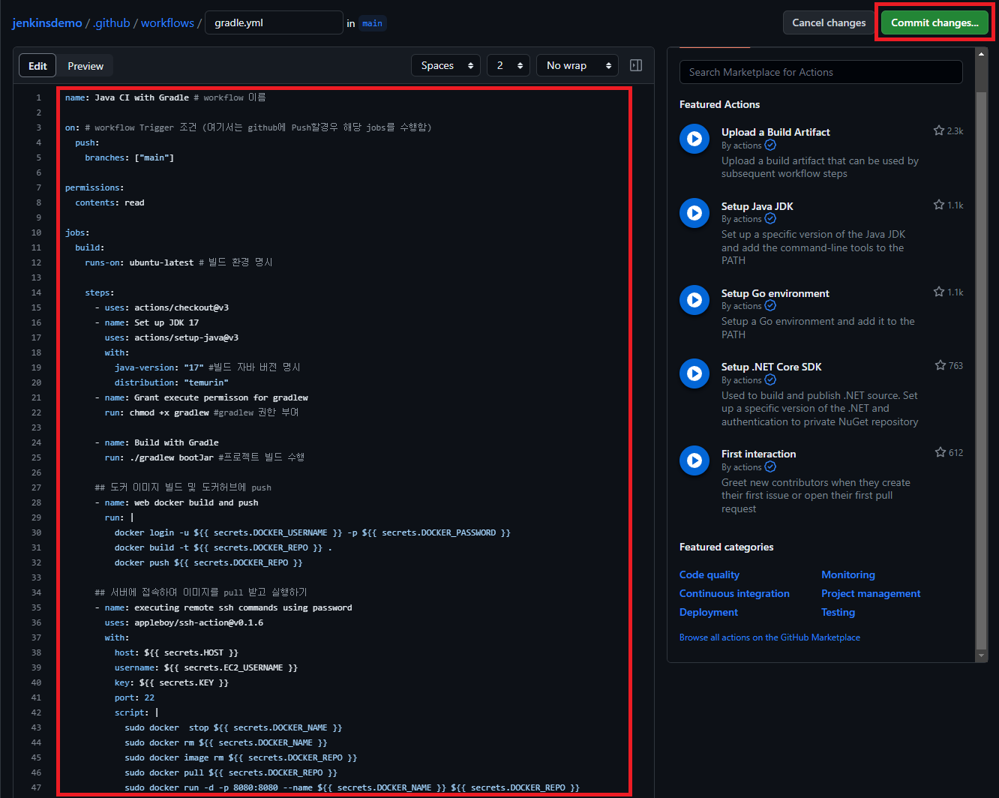 (그리고 다음과 같이 입력한뒤 Commit changes를 클릭해 Push한다.)\


```
name: Java CI with Gradle # workflow 이름

on:   # workflow Trigger 조건 (여기서는 github에 Push할경우 해당 jobs를 수행함)
  push:
    branches: ["main"]

permissions:
  contents: read

jobs:
  build:
    runs-on: ubuntu-latest # 빌드 환경 명시

    steps:
      - uses: actions/checkout@v3
      - name: Set up JDK 17
        uses: actions/setup-java@v3
        with:
          java-version: "17" #빌드 자바 버전 명시
          distribution: "temurin"
      - name: Grant execute permisson for gradlew
        run: chmod +x gradlew # gradlew 권한 부여
      - name: Build with Gradle
        run: ./gradlew bootJar # 프로젝트 빌드 수행

      # 도커 이미지 빌드 및 도커허브에 push
      - name: web docker build and push
        run: |
          docker login -u ${{ secrets.DOCKER_USERNAME }} -p ${{ secrets.DOCKER_PASSWORD }}
          docker build -t ${{ secrets.DOCKER_REPO }} .
          docker push ${{ secrets.DOCKER_REPO }}

      # 서버에 접속하여 이미지를 pull 받고 실행하기
      - name: executing remote ssh commands using password
        uses: appleboy/ssh-action@v0.1.6
        with:
          host: ${{ secrets.HOST }}
          username: ${{ secrets.EC2_USERNAME }}
          key: ${{ secrets.KEY }}
          port: 22
          script: |
            sudo docker  stop ${{ secrets.DOCKER_NAME }}
            sudo docker rm ${{ secrets.DOCKER_NAME }}
            sudo docker image rm ${{ secrets.DOCKER_REPO }}
            sudo docker pull ${{ secrets.DOCKER_REPO }}
            sudo docker run -d -p 8080:8080 --name ${{ secrets.DOCKER_NAME }} ${{ secrets.DOCKER_REPO }}

```

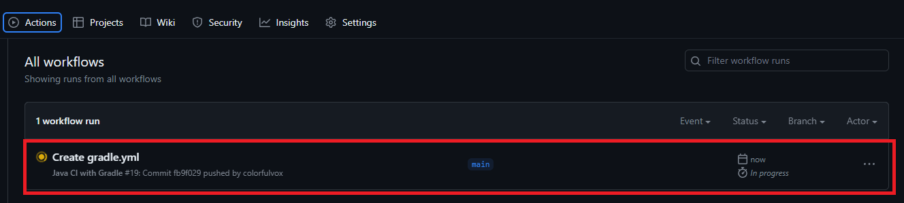\
(그리고 다시 action로 들어가면 workflow를 실행중인것을 볼 수 있다.)\


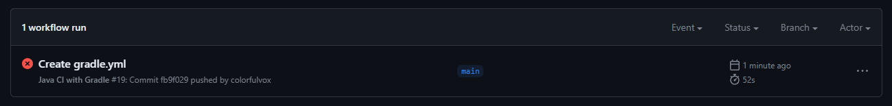\
(하지만 secrets 키에 대한 정보들이 없어 실패한다.)\


#### secrets 데이터 생성

Github에서는 숨기고 싶은 데이터를 관리할 수 있는 기능이 있다.\


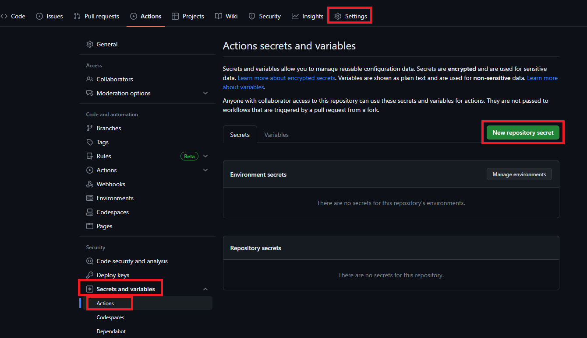\
(본인 프로젝트의 Settings -> Secrets and vaariables -> Action로 들어가 New repository secret으로 시크릿 데이터를 생성한다.)\


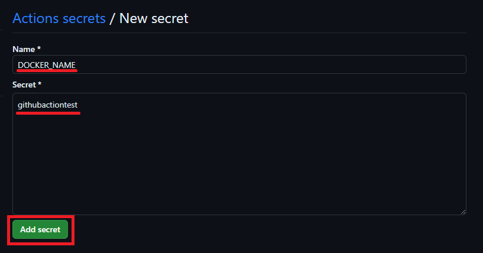\
(DOCKER\_NAME을 입력하고 컨테이너 이름을 Secret에 입력한다. 여기서는 도커허브의 레파지토리 이름으로 했다.)\


그리고 이런식으로\


1. secrets.DOCKER\_NAME \[컨테이너 이름]
2. secrets.DOCKER\_PASSWORD \[도커허브 비밀번호]
3. secrets.DOCKER\_REPO \[도커허브 레파지토리 ex) chuchumon/githubactiontest]
4. secrets.DOCKER\_USERNAME \[도커허브 닉네임]
5. EC2\_USERNAME \[EC2 User ex) ubuntu]
6. HOST \[EC2 IP주소]
7. KEY \[EC2 PEM키 파일]

에 대한 정보를 저장해야된다.\


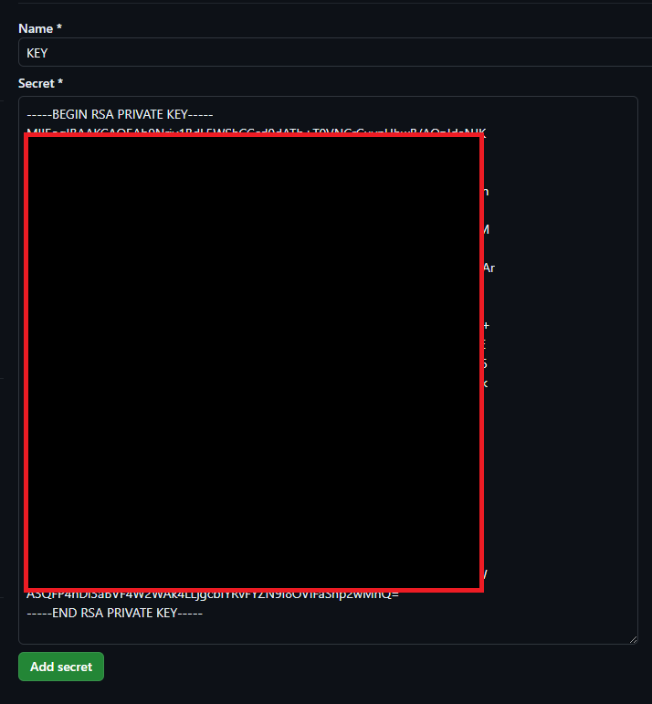\


(참고로 KEY 값은 모든 정보를 붙여넣으면 된다.)\


그럼 다음과 같이 시크릿 데이터가 저장되어 있으면 된다.\
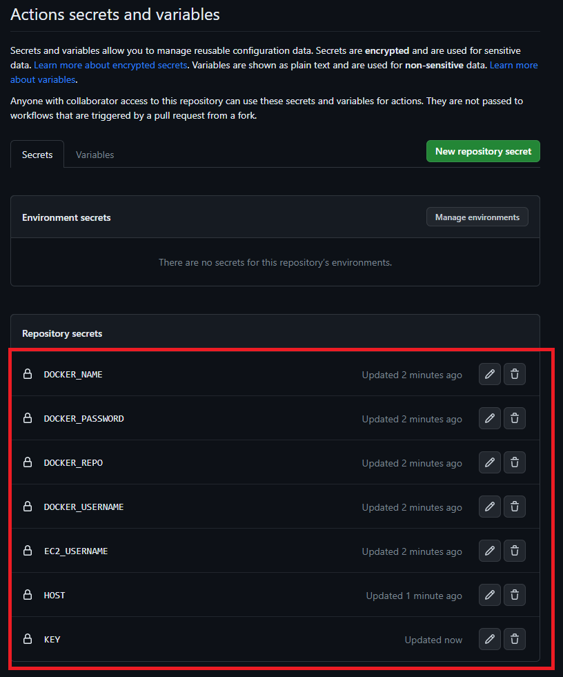\


#### workflow 실행

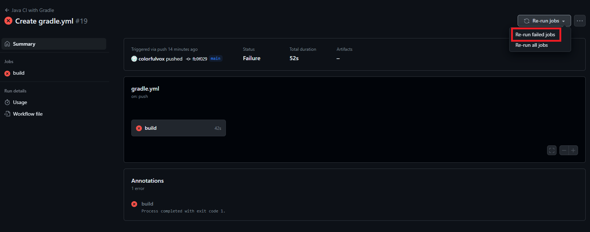\
(다시 action로 돌아가 실패한 workflow를 클릭한뒤 재실행 해보자)\


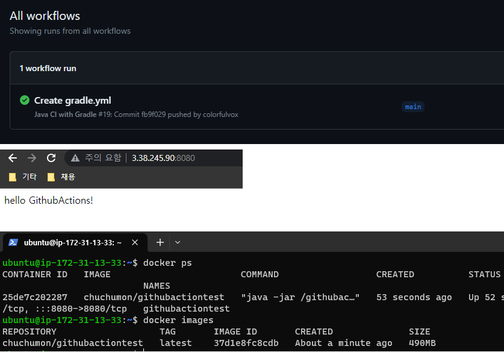\
(그럼 다음과 같이 workflow도 성공하고 배포도 이루어지는것을 볼 수 있다.)\


#### 테스트

현재 github를 push하면 Docker 이미지를 삭제한뒤 다시 pull받아 재배포를 하고 있다.\
프로젝트의 내용을 변경하고 push한뒤 결과를 보자.\


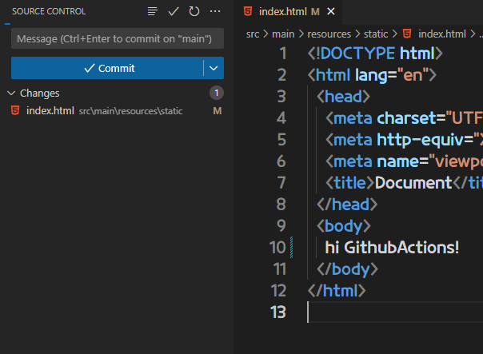\
(프로젝트를 수정하고 push 한다.)\


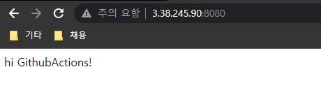\
(변경된 것을 볼 수 있다.)\
