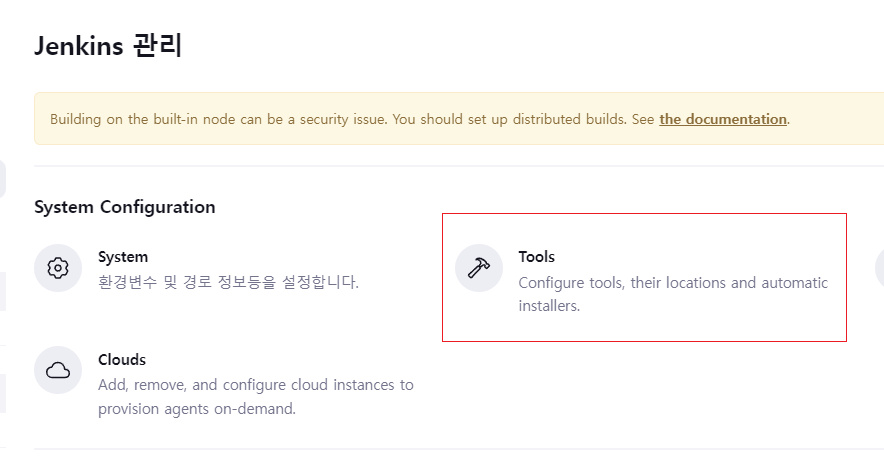
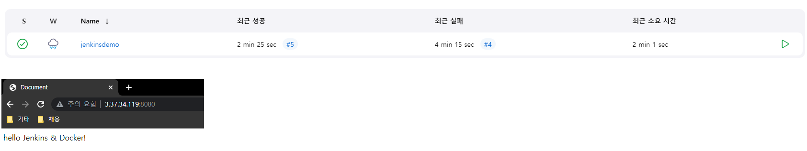

# Jenkins+Docker \[SpringBoot]

[뒤로가기](../)\

## Jenkins + Docker \[SpringBoot]

Webhook을 통해 Github의 프로젝트를 Jenkins로 자동 빌드를 하고, 빌드한 Jar파일을 도커 이미지로 빌드한다.\
그리고 생성된 도커 이미지를 DockerHub에 Push하고 DockerHub에\
올라간 도커 이미지를 Pull받아 컨테이너로 만든뒤 서버 배포\

### 구성도

### 사전 세팅

1. AWS EC2 Ubuntu 생성 및 환경 설정 [AWS EC2 생성](../AWS/EC2.md)
2. Springboot 프로젝트 생성 [SpringBoot 프로젝트 생성](<Local \[SpringBoot].md>)
3. SpringBoot 프로젝트 Github에 저장
4. Docker 설치 [Dokcer](../Docker.md)

### 환경

1. Jenkins 서버용 EC2 [Java SE-17](https://www.oracle.com/java/technologies/javase/jdk17-archive-downloads.html)\

2. WAS 서버용 EC2
3. VSCode\
   (1) Spring Boot Extension Pack\
   (2) Extension Pack for Java\
   (3) Gradle for Java\

#### \[권장] 

[Jenkins 서버 swap메모리 할당](../etc/Linux.md)

### 시작

### Jenkins 서버 환경 구축

#### (1) Dokcer 설치

생략 - [Docker 설치](../Docker.md)\

#### (2) Jenkins 이미지 Pull 및 컨테이너 실행

\

> docker pull jenkins/jenkins\
>

\

> docker run --privileged -d -p 8080:8080 -p 50000:50000 --name jenkins jenkins/jenkins\
>

(jenkins 이미지를 컨테이너로 넣어 실행)\
여기서 --privileged는 시스템의 주요 자원에 접근 할 수 있게 권한을 설정함\

#### (3) Jenkins 접속 확인 및 환경 설정

\

\

> docker exec -itu 0 jenkins /bin/bash\
>

(root권한으로 jenkins 이미지에 접근)\

\

> cat /var/jenkins\_home/secrets/initialAdminPassword\
>

(초기 비밀번호를 복사해 로그인)\
\
(jeknins가 제안하는 플러그인 설치)\

***

#### \[주의사항]

실습에 쓰이는 springboot 프로젝트는 현재 java17을 지원함\
하지만 jenkins의 java 버전이 11이므로 17로 변경을 해줘야함\
(본인의 프로젝트 자바 버전에 맞춰주세요.)\

Java 17로 설정하기\

\

> apt-get update\
>

(일단 Jenkins 이미지의 패키지를 업데이트 해줌)\

\

> apt-get install openjdk-17-jdk -y\
>

(openjdk17 버전 설치)\

\

> export JAVA\_HOME=/usr/lib/jvm/java-17-openjdk-amd64\
> echo $JAVA\_HOME\
>

(환경 변수 변경 및 확인\
JAVA\_HOME 경로 복사)\

\
(jenkins괸리 -> Tools로 이동)

\
(JDK installations에서 Add JDK를 누르고 다음과 같이 설정후 저장)\

***

#### (3) Jenkins 와 Github 연동 및 Webhook 설정

github에 저장된 본인 프로젝트와 Jenkins 연동 및 Webhook 설정은 [Jenkins \[SpringBoot\]](<Jenkins \[SpringBooot].md>)를 참고\

\[참고]\

#### \[1] SSH 키 경로

\

> ssh-keygen ssh-keygen -t rsa\
>

(키를 현재 경로에서 생성한 뒤)\

\

(해당 경로로 가면 생성된 키가 있음)\

#### \[2] 플러그인 설치 시 jenkins가 꺼짐 현상

\

(플러그인을 설치한뒤 restart를 해도 jenkins가 재실행이 안됨)\

\

> docker start jenkins\
>

(start 명령어로 실행하면 됨)\

#### (4) Github 연동 테스트

연동 테스트를 진행하기 전에 Springboot 프로젝트에 Dockerfile을 추가하도록 하겠음\

\

> From openjdk:17-oracle\
> ARG JAR\_FILE=build/libs/jenkinsdemo.jar\
> ADD ${JAR\_FILE} jenkinsdemo.jar\
> ENTRYPOINT \["java","-jar","/jenkinsdemo.jar"]\
>

(jar을 파일명은 본인 프로젝트 jar파일 명으로 수정\
저장하고 git 커밋)\

\
(빌드는 진행하지 않지만 Github과 연동이 되는것을 확인 할 수 있음)\

#### (5) Jenkins 컨테이너에 Docker 설치

Jenkis로 프로젝트를 빌드한뒤 Docker 이미지를 생성해 DockerHub에 저장\

\

> apt-get update\
>

(패키지 업데이트)\

\

> apt-get install \\\
> ca-certificates \\\
> curl \\\
> gnupg \\\
> lsb-release\
>

(필수 패키지 설치)\

\

> mkdir -p /etc/apt/keyrings\
>

\

curl -fsSL https://download.docker.com/linux/debian/gpg | gpg --dearmor -o /etc/apt/keyrings/docker.gpg echo \\\
"deb \[arch=$(dpkg --print-architecture) signed-by=/etc/apt/keyrings/docker.gpg] https://download.docker.com/linux/debian \\\
$(lsb\_release -cs) stable" | tee /etc/apt/sources.list.d/docker.list > /dev/null\

(Docker 설치 환경 설정)\

\

> apt-get update\
>

(패키지 업데이트)\

\

> apt-get install docker-ce docker-ce-cli containerd.io docker-compose-plugin\
>

(도커 설치)\

\

> service docker start\
>

(도커 실행)\

\

> usermod -aG docker root\
> su - root\
>

(Docker 그룹에 root 계정 추가)\

\

> chmod 666 /var/run/docker.sock\
>

(docker.sock 권한 변경)\

\

> docker login\
>

(docker 로그인 \[본인 계정으로 로그인])\

#### (6) Jenkins publish over ssh 설정

publish over ssh 설치와 설정은 [Jenkins \[SpringBoot\]](<Jenkins \[SpringBooot].md>)를 참고

#### \[빌드 관련] 

\

Build steps에서\
\
chmod +x gradlew\
./gradlew clean build\
를 입력해 프로젝트를 빌드 설정\

docker login -u 본인유저네임 -p 본인비밀번호 docker.io\
docker build -t 본인유저네임/레파지토리명 .\
docker push 본인유저네임/레파지토리명\
으로 설정\

\[주의사항] 레파지토리명은 빌드파일명으로 하는것을 추천 (jenkinsdemo.jar)\

\

(빌드후 조치에서 Send build artifacts over SSH을 선택)\

docker login -u 본인유저네임 -p 본인비밀번호 docker.io\
docker pull 본인유저네임/레파지토리명\
docker ps -q --filter name=컨테이너명 | grep -q . && docker rm -f $(docker ps -aq --filter name=컨테이너명)\
docker run -d --name 컨테이너명 -p 8080:8080 본인유저네임/레파지토리명\

(참고로 filter는 실행중인 컨테이너가 있으면 해당 컨테이너를 중지하고 삭제하는 것임)\

(이상태로 저장)\

### DockerHub 레파지토리 생성

\
(Dockerhub에 접속해 본인의 레파지토리 생성) [Dockerhub 생성법](../Docker.md)\

### was 서버 Docker 설치

[Docker 설치](../Docker.md)\

\[주의사항]\
\

> sudo usermod -aG docker $USER\
> sudo su - $USER\
>

(docker 그룹에 계정을 추가)\

### 빌드 테스트

\
(서버 배포가 된것을 확인)\

### 최종 테스트

\
(프로젝트를 수정한뒤 Github에 커밋)\

\
(자동으로 WAS의 컨테이너를 삭제하고 배포 하는것을 볼 수 있음)\
