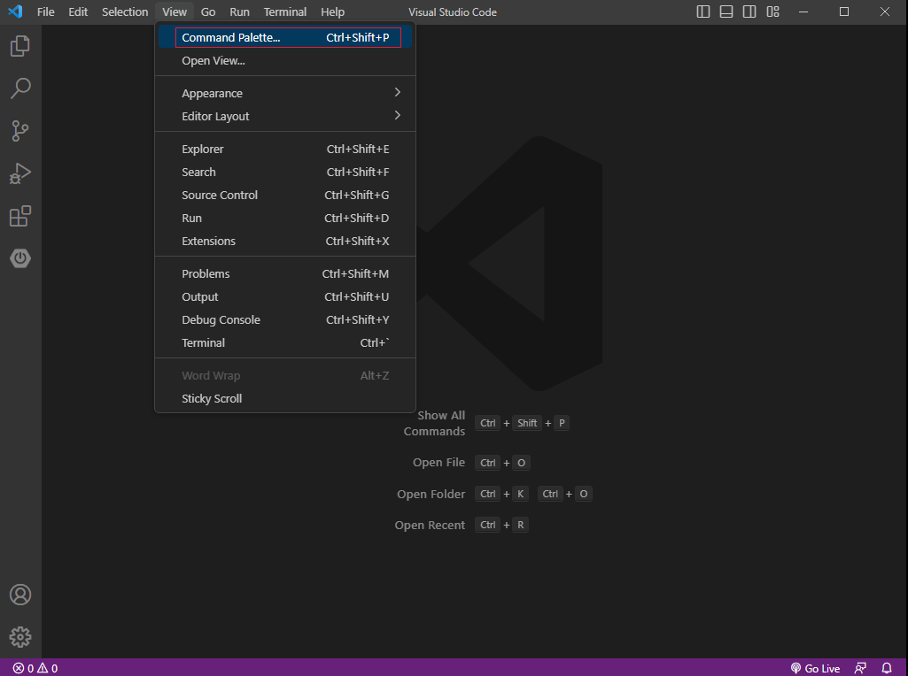
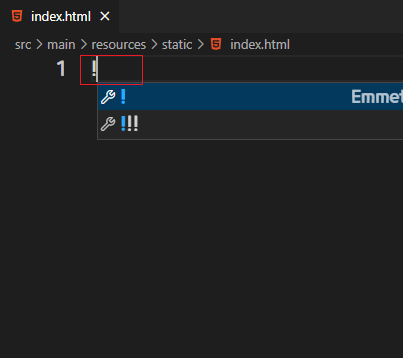
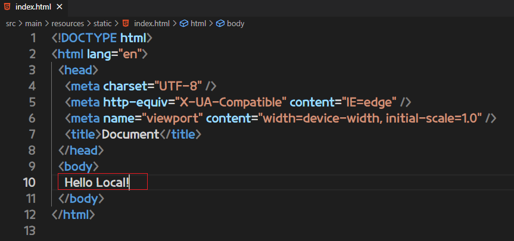
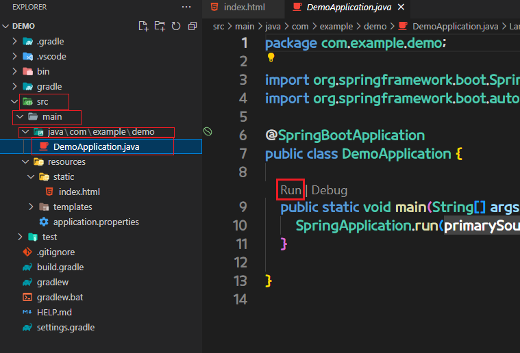
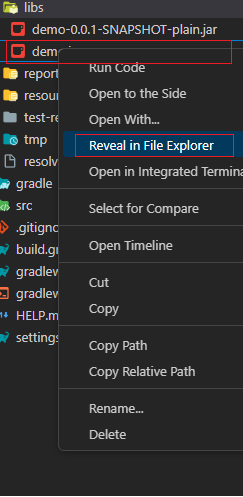
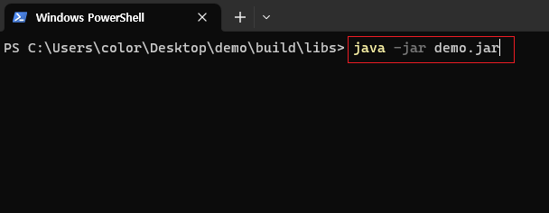
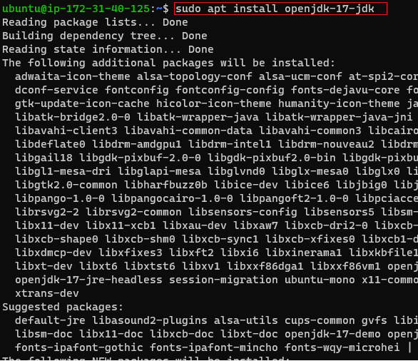
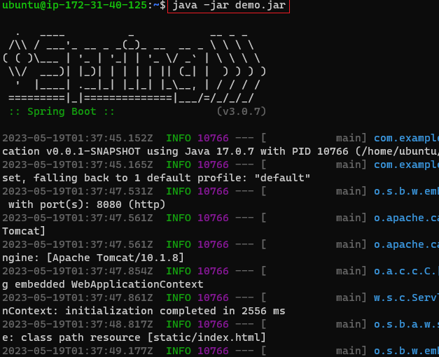
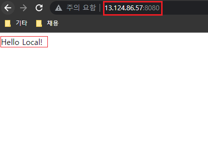

# Local \[SpringBoot]

[뒤로가기](../)

## Local \[SpringBoot]

LocalPC에서 SpringBoot 프로젝트를 빌드한뒤 해당 파일을 EC2에 전송시켜 서버 배포

### 구성도

### 환경

[Java SE-17](https://www.oracle.com/java/technologies/javase/jdk17-archive-downloads.html)\
VSCode

1. Spring Boot Extension Pack
2. Extension Pack for Java
3. Gradle for Java

EC2 - Ubuntu (AWS EC2 생성 과정 참조) [EC2](../AWS/EC2.md)

### 시작

#### (1) SpringBoot 프로젝트 생성

\
\
(Create a Gradle Project로 선택)\
다음은 이 순서대로 세팅\
3.0.7 -> Java -> com.example -> demo -> Jar -> 17 -> Spring Web (해당 항목만 체크하고 생성)\
\

\[주의사항] 해당 위치에 Gradle Error 발생 알림이 뜨면 Vscode의 Java 환경 세팅 수정 \
\

\
(vscode File -> Preferences -> Settings 이동)\
\
\
(java home 검색 -> Edit in settings.json 클릭)\
\
\
(해당 항목들로 구성되어 있는지 확인)\
\

\
(src -> main -> resources -> static에 이동후 index.html 파일 생성)\
\
(index 파일에 !입력 후 엔터) \
(body에 텍스트 작성후 저장)

\
(java -> DemoApplication.java 클릭하고 Run 클릭) \
(웹사이트에서 localhost:8080 입력 후 정상 작동하는지 확인)

#### (2) Gradle로 빌드후 Jar파일 생성

\
(코끼리 아이콘 클릭 -> Tasks -> build -> build에 실행 아이콘 클릭)\
\

\[참고] 빌드 jar파일 이름 변경하기 \
(프로젝트 폴더의 build.gradle파일에 해당 항목을 추가한뒤 원하는 이름으로 수정)\
\

\
(빌드가 완료되면 프로젝트 폴더에 build -> libs -> 원하는이름.jar 파일이 생성된 것을 확인)\

\
(해당 파일을 오른쪽 클릭 한뒤 Reveal in File Explorer을 클릭해 해당 폴더 열기) \
(폴더가 열리면 오른쪽 클릭 후 터미널 열기\
만약 터미널이 없을 경우 CMD를 열어 "cd 폴더 경로" 를 입력해 이동)\
\
\
(java -jar 해당파일.jar 를 입력 후 실행한뒤 다시 웹사이트에서 localhost:8080을 입력해 작동하는지 확인)\

#### (3) EC2 환경 세팅

(3\_1) 탄력적 IP 할당\
인스턴스의 Public IP는 고정 IP가 아닌 유동적인 IP이다.\
(그래서 인스턴스를 중지하고 다시 실행하면 IP가 바뀐다.)\
그래서 고정된 IP를 생성해 인스턴스에 연결해준다.\
\
\
(AWS로 가서 탄력적 IP 클릭)\
\
(탄력적 IP 주소 할당 클릭)\
\
(할당 클릭)\
\
(할당된 IP 클릭)\
\
(탄력적 IP 주소 연결 클릭)\
\
(연결할 인스턴스를 선택하고 연결 클릭)\
서버에 배포후 해당 IP주소로 접속 하면 됨\

(3\_2) 보안 그룹 생성\
SprintBoot의 기본 포트는 8080 하지만, \
현재 인스턴스에 접속 가능한 포트는 22 밖에 없음\
그래서 8080포트를 생성 해야됨\
\
\
(보안 그룹에서 보안 그룹 생성 클릭) \
(그룹 이름과 설명을 입력하고\
규칙을 추가하면서 해당 항목에 맞게 구성하고 보안 그룹 생성 클릭)\
\
(인스턴스로 돌아가서 작업 -> 보안 -> 보안 그룹 변경)\
\
(생성한 보안 그룹을 선택한뒤 그룹 추가 후 저장\
\[이미 연결된 보안 그룹은 제거해도 됨])\

\
(이렇게 구성되면 완료)\

#### (4) 우분투 환경 세팅

\
(터미널로 우분투 접속)\

\[참고]\
기본적으로 우분투 생성시\
sudo apt-get update\
sudo apt-get upgrade\
해주면 좋음\
\

\
(sudo apt install openjdk-17-jdk 을 입력 후 JDK 설치)\
\
(java -version으로 설치되었는지 확인)

#### (5) 로컬에서 빌드한 jar 파일 우분투에 보내기

\
(생성된 jar파일을 pemkey파일이 있는 폴더로 이동한 뒤 터미널 실행)\

\
scp -i \[pem파일경로] \[업로드할 파일 이름] \[ec2-user계정명]@\[ec2 instance의 public DNS]:\~/\[경로]\
"\[ec2-user계정명]@\[ec2 instance의 public DNS]" 해당 부분은 인스턴스 연결의 SSH 클라이언트의 예시를 참고\
(해당 명령어에 맞춰 입력)\
\
(다시 우분투로 돌아가 ls 명령어로 옮겨졌는지 확인)\
\
(java -jar 파일이름.jar 명령어로 실행)\
\
(웹사이트로 가서 할당 받은 IP주소:8080으로 접속이 되는지 확인)\

\[참고]\
우분투 터미널을 닫으면 서버가 중지되거나 다른 작업도 할 수 없는 상태임\
그래서 백그라운드로 해당 프로그램을 실행시켜 서버를 유지시켜야됨\

\
(nohup java -jar 파일이름.jar & 을 입력해 백그라운드 실행)\
\[이제 터미널이 닫혀도 서버 접속이 가능하고 다른 작업도 가능함]

해당 프로그램을 종료하고 싶을 때\
\
(ps -ef | grep java로 실행되고 있는 프로그램의 PID를 확인 \[11061] )\
\
(kill -9 해당PID 을 입력해 프로그램 종료)
